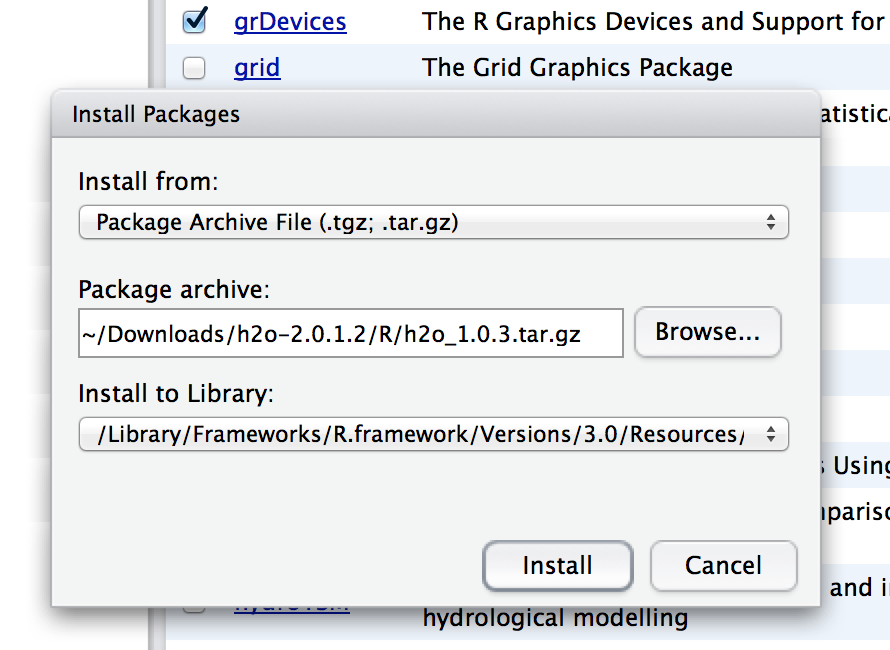
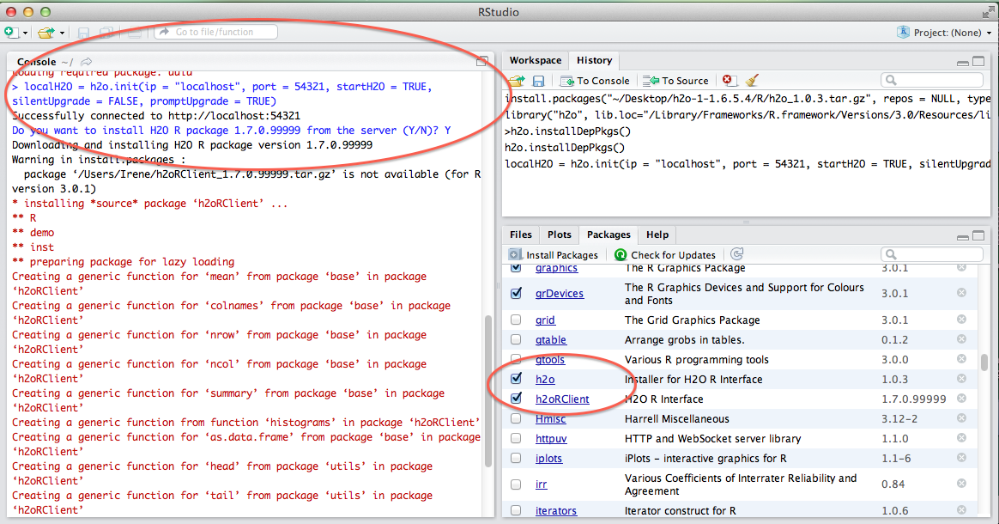

H\ :sub:`2`\ O in R Studio
---------------------------

Installation of H\ :sub:`2`\ O Package in R
""""""""""""""""""""""""""""""""""""""""""""

These instructions assume you are using R Studio 2.14.0 or later.  

**STEP 1**

The download package can be obtained by clicking on the button Download H\ :sub:`2`\ O at `http://0xdata.com/downloadtable <http://0xdata.com/downloadtable/>`_.

Unzip the downloaded H\ :sub:`2`\ O zip file.

**STEP 2**

Start an instance of H\ :sub:`2`\ O. For help with this see :ref:`GettingStartedFromaZipFile`

Users should be aware that in order for H\ :sub:`2`\ O to successfully run through R, an instance of H\ :sub:`2`\ O must also simultaneously be running. If the instance of H\ :sub:`2`\ O is stopped, the R program will no longer run, and work done will be lost. 

**STEP 3: R Studio Users**

Install the H\ :sub:`2`\ O package, and the H\ :sub:`2`\ O client package simultaneously by clicking on install package 

.. image:: Rinstall.png
   :width: 70%
 
Walk through the installer helper to the H\ :sub:`2`\ O downloaded folder.  

Once the correct path has been specified click "Install." This will install the package in R. 

Start the H\ :sub:`2`\ O package by clicking the check box next to the package name "h2o". 
  

.. image:: Rcheckbox.png
   :width: 70%

**STEP 4**

Get R Studio talking to your instance of H\ :sub:`2`\ O by typing in the call: 

::

  >localH2O = h2o.init(ip = "localhost", port = 54321, startH2O = TRUE, silentUpgrade = FALSE, promptUpgrade = TRUE)

Your IP and port may be different, depending on whether you are running H\ :sub:`2`\ O from your computer or a server. If you are running on a server, where it says IP enter the IP address of the server, and the appropriate port number. In the picture below the IP number is everything before the colon, and the port number is the 5 digit string after the colon.

Upgrading the H\ :sub:`2`\ O R Packages
"""""""""""""""""""""""""""""""""""""""

Users may wish to manually upgrade their R packages. For instance, if you are running the bleeding edge developer build, it’s possible that the code has changed, but that the revision number has not, in which case manually upgrading ensures the most current version of not only the H2O code, but the corresponding R code as well.

 

