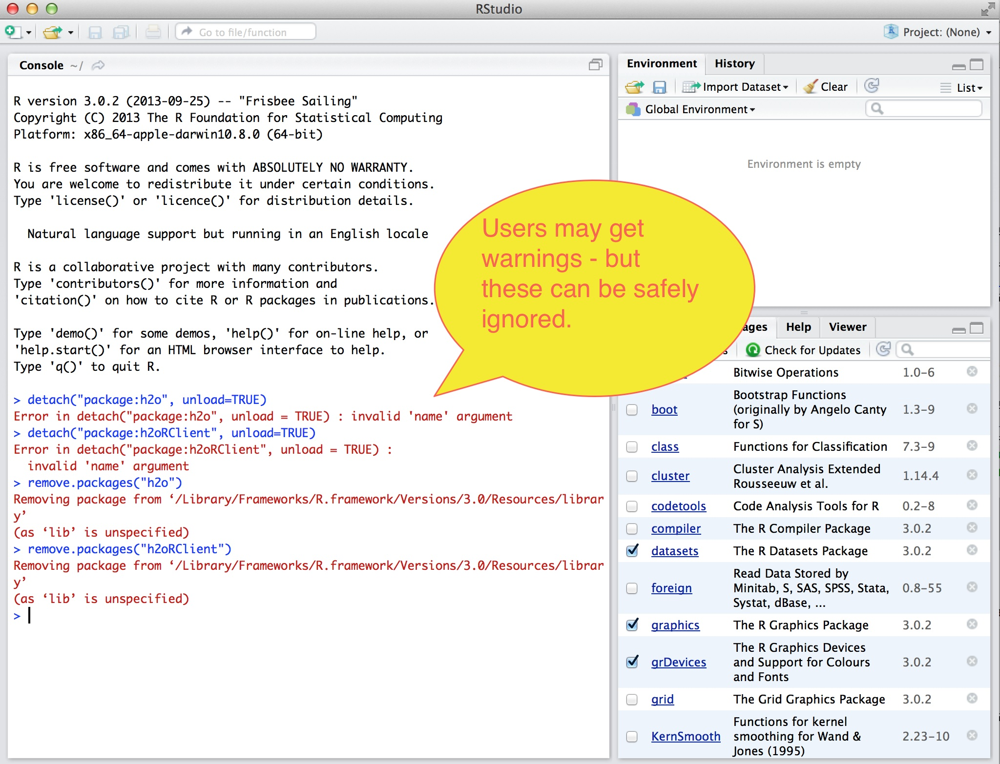
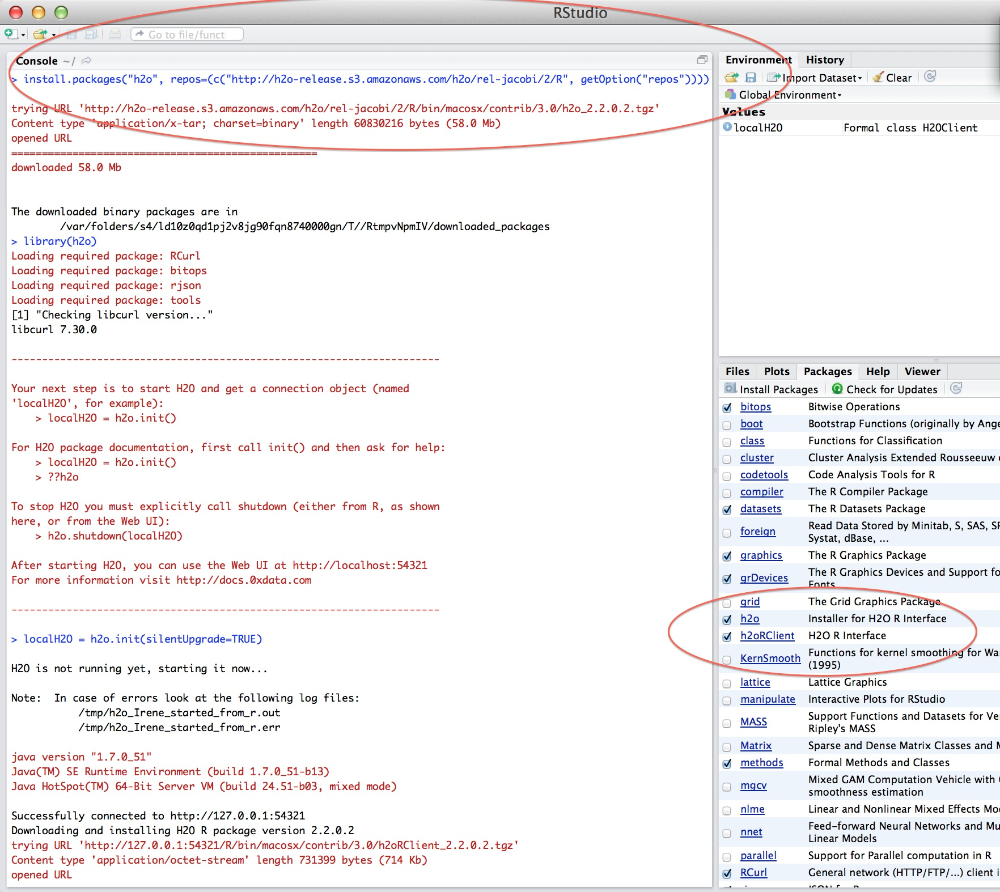

H\ :sub:`2`\ O in R Studio
---------------------------

These instructions assume you are using R Studio 2.14.0 or later.  

**STEP 1**

To use H\ :sub: `2`\ O in R, users need a copy of  H\ :sub: `2`\ O. 
The download package can be obtained by clicking on the button Download H\ :sub:`2`\ O at `http://0xdata.com/downloadtable <http://0xdata.com/downloadtable/>`_.

Unzip the downloaded H\ :sub:`2`\ O zip file.

**STEP 2**

Start an instance of H\ :sub:`2`\ O. For help with this see :ref:`GettingStartedFromaZipFile`

Users should be aware that in order for H\ :sub:`2`\ O to successfully run through R, an instance of H\ :sub:`2`\ O must also simultaneously be running. If the instance of H\ :sub:`2`\ O is stopped, the R program will no longer run, and work done will be lost. 

**STEP 3** 

For users who may have already installed a prior version of the H2O
package. New users may skip this step. 

For packages to be successfully removed and updated in R studio - they
must first be detatched from the R environment and then uninstalled. 
Simply enter the following: 

::

   detach("package:h2o", unload=TRUE) 
   detach("package:h2oRClient", unload=TRUE) 
   remove.packages("h2o") 
   remove.packages("h2oRClient") 

Note: users may get warnings of the type "Error in
detatch("package:h2o", unload = TRUE): invalid 'name' argument. 
This tells users that there is no h2o package to uninstall. These
warnings can safely be ignored. 

**STEP 4**

Install the H\ :sub:`2`\ O package from the H2ORepo, the H2O cran that
functions exactly like the usual R cran, but is managed and maintained
by H2O. 
Simply enter the call: 

::

  install.packages("h2o", repos=(c("http://h2o-release.s3.amazonaws.com/h2o/rel-jacobi/2/R", getOption("repos"))))
 
as shown here:

 

**STEP 4**

If you have not started an instance of H2O from your command line
terminal, R will start an instance for you automatically. If you have
already started an instance, H2O R will connect to this instance, and
no other instance will be started. 

Get R Studio talking to your instance of H\ :sub:`2`\ O by typing in the call: 

::

  >localH2O = h2o.init(ip = "localhost", port = 54321, startH2O = TRUE, silentUpgrade = FALSE, promptUpgrade = TRUE)

Your IP and port may be different, depending on whether you are running H\ :sub:`2`\ O from your computer or a server. If you are running on a server, where it says IP enter the IP address of the server, and the appropriate port number. In the picture below the IP number is everything before the colon, and the port number is the 5 digit string after the colon.

Upgrading the H\ :sub:`2`\ O R Packages
"""""""""""""""""""""""""""""""""""""""

Users may wish to manually upgrade their R packages. They can do this
by returning to STEP 3, and following the instructions through
STEP 4. 

 

