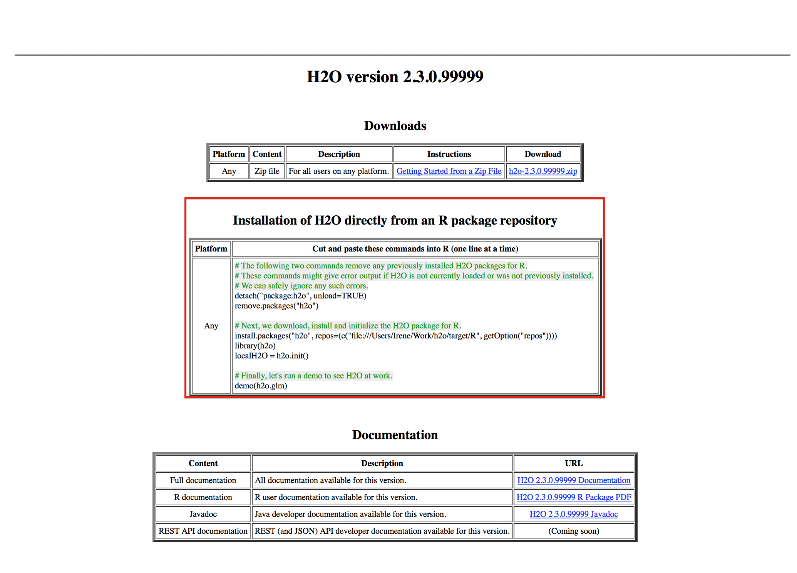

.. _R_Installation:

Install H\ :sub:`2`\ O package in R
===================================

Currently there are three different ways to install the H\ :sub:`2`\ O package in R and depending on the build or version
of H\ :sub:`2`\ O the user wants to install one method will be more applicable than the others. The instructions below will
walk the user through download from CRAN, download from 0xdata website, and install from the most recent source code; all of
which makes the assumption that the R session is running R 2.13.0 or later.

- 0xdata website has the most recent stable releases of H\ :sub:`2`\ O as well as the bleeding edge nightly build
- CRAN has a policy of updating packages every few weeks to months so the most recent or the last stable release would be available
- Git has most recent changes committed and a build will be made nightly from the source code, however stability is not guaranteed

Quick Start Video
"""""""""""""""""

.. raw:: html

 <object width="425" height="344"><param name="movie"
 value="http://www.youtube.com/v/deRpTB9k77k&hl=en&fs=1"></param><param
 name="allowFullScreen" value="true"></param><embed
 src="http://www.youtube.com/v/deRpTB9k77k&hl=en&fs=1"
 type="application/x-shockwave-flash" allowfullscreen="true"
 width="425" height="344"></embed></object>

Dependencies
""""""""""""
The H\ :sub:`2`\ O package is built with some required packages so in order to properly install H\ :sub:`2`\ O's package remember
to install the following dependencies all of which is available in CRAN:

    - RCurl
    - bitops
    - rjson
    - statmod
    - tools

Download zip file from 0xdata.com
"""""""""""""""""""""""""""""""""

**Step 1**

Download one of the release from our `website <http://0xdata.com/download/>`_. The downloaded package will contain both the
H\ :sub:`2`\ O jar file as well as the R tar package file for R installation. After download completes, unzip the file and navigate to the
R subdirectory with the tar package.

::

  $ unzip h2o-2.7.0.1497.zip
  $ cd h2o-2.7.0.1497/R
  $ pwd
    /c/Users/Amy/Downloads/h2o-2.7.0.1497/R

**Step 2**

Start up R or Rstudio and install the R client package by running install.packages and inputting the location of the tar file. Finally load the library
and check that a simple demo script runs.

::

  > install.packages("C:/Users/Amy/Downloads/h2o-2.7.0.1497/R/h2o_2.7.0.1497.tar.gz",
    repos = NULL, type = "source")
  > library(h2o)
  > demo(h2o.glm)

Download R Package directly from 0xdata.com
"""""""""""""""""""""""""""""""""""""""""""

Navigate to one of releases available on our `website <http://0xdata.com/download/>`_. Select the *INSTALL in R* tab and follow the R code for installation.

::

  # The following two commands remove any previously installed H2O packages for R.
  if ("package:h2o" %in% search()) { detach("package:h2o", unload=TRUE) }
  if ("h2o" %in% rownames(installed.packages())) { remove.packages("h2o") }

  # Next, we download, install and initialize the H2O package for R.
  install.packages("h2o", repos=(c("http://s3.amazonaws.com/h2o-release/h2o/master/1497/R", getOption("repos"))))
  library(h2o)
  localH2O = h2o.init()

  # Finally, let's run a demo to see H2O at work.
  demo(h2o.glm)

Download from CRAN
""""""""""""""""""

When downloading from CRAN keep in mind that the initial download from CRAN contain only the R package but when running h2o.init()
for the first time R will automatically download the corresponding H\ :sub:`2`\ O jar file, before launching H\ :sub:`2`\ O.

::

  > install.packages("h2o")
  > library(h2o)
  > localH2O = h2o.init()

  H2O is not running yet, starting it now...
  Performing one-time download of h2o.jar from
        http://s3.amazonaws.com/h2o-release/h2o/rel-knuth/11/Rjar/h2o.jar
  (This could take a few minutes, please be patient...)

Make a build from Git
"""""""""""""""""""""

**Step 1**

For developers who want to actually make changes to the R package before building and installing it, start with pulling the
source code from `Git <https://github.com/0xdata/h2o>`_ and follow the instructions in :ref:`QuickstartGit`.

**Step 2**

Once a build has been made, navigate to the target directory and subsequently to the Rcran folder with the R package and run an install.

::

  Amy@LENOVO-PC ~/Documents/h2o/target/Rcran (master)
  $ R CMD INSTALL h2o_2.7.0.99999.tar.gz
  * installing to library 'C:/Users/Amy/Documents/R/win-library/3.0'
  * installing *source* package 'h2o' ...
  ** R
  ** demo
  ** inst
  ** preparing package for lazy loading
  Warning: package 'statmod' was built under R version 3.0.3
  Creating a generic function for 'summary' from package 'base' in package 'h2o'
  Creating a generic function for 'colnames' from package 'base' in package 'h2o'
  Creating a generic function for 't' from package 'base' in package 'h2o'
  Creating a generic function for 'colnames<-' from package 'base' in package 'h2o'
  Creating a generic function for 'nrow' from package 'base' in package 'h2o'
  Creating a generic function for 'ncol' from package 'base' in package 'h2o'
  Creating a generic function for 'sd' from package 'stats' in package 'h2o'
  Creating a generic function for 'var' from package 'stats' in package 'h2o'
  Creating a generic function for 'as.factor' from package 'base' in package 'h2o'
  Creating a generic function for 'is.factor' from package 'base' in package 'h2o'
  Creating a generic function for 'levels' from package 'base' in package 'h2o'
  Creating a generic function for 'apply' from package 'base' in package 'h2o'
  Creating a generic function for 'findInterval' from package 'base' in package 'h2o'
  ** help
  *** installing help indices
  ** building package indices
  ** testing if installed package can be loaded
  *** arch - i386
  Warning: package 'statmod' was built under R version 3.0.3
  *** arch - x64
  Warning: package 'statmod' was built under R version 3.0.3
  * DONE (h2o)

**Step 3**

Check that H\ :sub:`2`\ O is install properly by running:

::

  > library(h2o)
  > localH2O = h2o.init()

Upgrading Packages
""""""""""""""""""

When upgrading H\ :sub:`2`\ O the user will need to upgrade their R package as well. In order to prevent a version mismatch, it is
recommended that users manually upgrade their R packages. For instance, if you are running the bleeding edge developer build,
it’s possible that the code has changed, but that the revision number has not, in which case manually upgrading ensures the most
current version of not only the H\ :sub:`2`\ O code, but the corresponding R code as well.

Simply detach the package and remove it from R before going through the installation process again:

::

  if ("package:h2o" %in% search()) { detach("package:h2o", unload=TRUE) }
  if ("h2o" %in% rownames(installed.packages())) { remove.packages("h2o") }

