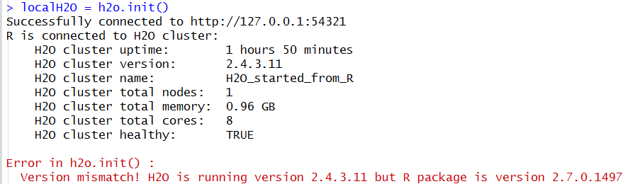

.. _R_Tutorial:

R Tutorial
==========

The purpose of this tutorial is to give a sample workflow for new users of H\ :sub:`2`\ O's R API.
The objective is to learn the basic syntax of H\ :sub:`2`\ O, including importing and parsing files,
specifying a model, and obtaining model output.

Those who have never used H\ :sub:`2`\ O before should see the quick start guide for additional
instructions on how to run H\ :sub:`2`\ O. The following tutorial will follow the assumption that the user was
able to install H\ :sub:`2`\ O in R.

Getting Started
"""""""""""""""

R uses an REST API to send directives to H\ :sub:`2`\ O which means that we need a reference object in R to the H\ :sub: `2`\ O instance.
The user can either start H\ :sub:`2`\ O outside of R and connect to it after or the user can launch directly from R and when the R session
closes the H\ :sub:`2`\ O instance will be killed with it. The client object will later be used to direct R to datasets and models sitting in
H\ :sub:`2`\ O.

**Launch From R**

By default if the argument max_mem_size is not specified when running h2o.init() the heap size of the H\ :sub:`2`\ O running on 32-bit Java is
1g and on 64-bit Java is 1/4 of the total memory available on the machine. If the user is using a 32-bit version the function will run a check
and suggest an upgrade.

::

  library(h2o)
  localH2O <- h2o.init(ip = 'localhost', port = 54321, max_mem_size = '4g')

**Launch From Command Line**

Launch an instance from the command line on your desktop, on ec2 instances, or Hadoop servers by following one of the deployment tutorials.
Once the H\ :sub:`2`\ O cluster is launched, simply initialize the connection by taking one node in the cluster and run h2o.init with its
IP Address and port.

::

  library(h2o)
  localH2O <- h2o.init(ip = '192.168.1.161', port =54321)

.. WARNING::
  If the version of H\ :sub:`2`\ O instance running is different from the package version loaded in R,
  a warning message indicating a version mismatch will appear. To fix this issue either update the R package
  or launch an H\ :sub:`2`\ O instance using the jar file from the installed package.

**Cluster Info**

At any point if the user want to check on the status and health of the H\ :sub:`2`\ O cluster h2o.clusterInfo() returns an easy to read
list of information on the cluster.

::

  library(h2o)
  localH2O = h2o.init(ip = 'localhost', port = 54321)
  h2o.clusterInfo(localH2O)

Importing Data
""""""""""""""

**Import File**

H\ :sub:`2`\ O's package has consolidated all the different import functions supported. Although h2o.importFolder and h2o.importHDFS will still work,
it should be noted that these functions are deprecated and should be updated to h2o.importFile.

::

  ## To import small iris data file from H\ :sub:`2`\ O's package
  irisPath = system.file("extdata", "iris.csv", package="h2o")
  iris.hex = h2o.importFile(localH2O, path = irisPath, key = "iris.hex")
  summary(iris.hex)

  ## To import an entire folder of files as one data object
  pathToFolder = "/Users/Amy/0xdata/data/airlines/"
  airlines.hex = h2o.importFile(localH2O, path = pathToFolder, key = "airlines.hex")
  summary(airlines.hex)

  ## To import from HDFS
  pathToData = "hdfs://mr-0xd6.0xdata.loc/datasets/airlines_all.csv"
  airlines.hex = h2o.importFile(localH2O, path = pathToData, key = "airlines.hex")
  summary(airlines.hex)

**Upload File**

To upload a file from your local disk you can run upload file, however importFile is recommend if applicable.

::

  irisPath = system.file("extdata", "iris.csv", package="h2o")
  iris.hex = h2o.uploadFile(localH2O, path = irisPath, key = "iris.hex")
  summary(iris.hex)

Data Manipulation and Description
"""""""""""""""""""""""""""""""""
**Any Factor**

  Used to determine if any column in a data set is a factor.

::

  irisPath = system.file("extdata", "iris_wheader.csv", package="h2o")
  iris.hex = h2o.importFile(localH2O, path = irisPath)
  h2o.anyFactor(iris.hex)

**As Data Frame**

  Used to convert an H\ :sub:`2`\ O parsed data object into an R data frame
  (which can subsequently be manipulated using R calls). While this is
  frequently useful, as.data.frame should be used with care when
  converting H\ :sub:`2`\ O Parsed Data objects. Data sets that are easily and
  quickly handled by H\ :sub:`2`\ O are often too large to be treated
  equivalently well in R. 

::

  prosPath <- system.file("extdata", "prostate.csv", package="h2o")
  prostate.hex = h2o.importFile(localH2O, path = prosPath)
  prostate.data.frame<- as.data.frame(prostate.hex)
  summary(prostate.data.frame)
  head(prostate.data.frame)

**As Factor**

  Used to convert an integer into a non-ordered factor (alternatively
  called an enum or categorical).

::

  prosPath = system.file("extdata", "prostate.csv", package="h2o")
  prostate.hex = h2o.importFile(localH2O, path = prosPath)
  prostate.hex[,4] = as.factor(prostate.hex[,4])
  summary(prostate.hex)

**As H2O** 

  Used to pass a data frame from inside of the R environment to the H\ :sub:`2`\ O instance.

::

  data(iris)
  summary(iris)
  iris.r <- iris
  iris.h2o <- as.h2o(localH2O, iris.r, key="iris.h2o")
  class(iris.h2o)

**Assign H2O**

  Used to create an hex key on the server where H\ :sub:`2`\ O is running for data sets manipulated   in R. 
  For instance, in the example below, the prostate data set was
  uploaded to the H\ :sub:`2`\ O instance, and was manipulated to remove
  outliers. Saving the new data set on the H\ :sub:`2`\ O server so that it can
  be subsequently be analyzed with H\ :sub:`2`\ O without overwriting the original
  data set relies on h2o.assign.

::
 
  prosPath = system.file("extdata", "prostate.csv", package="h2o")
  prostate.hex = h2o.importFile(localH2O, path = prosPath)
  prostate.qs = quantile(prostate.hex$PSA)
  PSA.outliers = prostate.hex[prostate.hex$PSA <= prostate.qs[2] | prostate.hex$PSA >=   prostate.qs[10],]
  PSA.outliers = h2o.assign(PSA.outliers, "PSA.outliers")
  nrow(prostate.hex)  
  nrow(PSA.outliers)

**Colnames**

  Used to obtain a list of the column names in a data set. 

::

  irisPath = system.file("extdata", "iris.csv", package="h2o")
  iris.hex = h2o.importFile(localH2O, path = irisPath, key = "iris.hex")
  summary(iris.hex)
  colnames(iris.hex)
  

**Extremes**

  Used to obtain the maximum and minimum values in real valued columns. 

::

  ausPath = system.file("extdata", "australia.csv", package="h2o")
  australia.hex = h2o.importFile(localH2O, path = ausPath, key = "australia.hex")
  min(australia.hex)
  min(c(-1, 0.5, 0.2), FALSE, australia.hex[,1:4])

**Quantiles**

  Used to request quantiles for an H\ :sub:`2`\ O parsed data set. When requested
  for a full parsed data set quantiles() returns a matrix displaying
  quantile information for all numeric columns in the data set.
 

::

  prosPath = system.file("extdata", "prostate.csv", package="h2o")
  prostate.hex = h2o.importFile(localH2O, path = prosPath)
  quantile(prostate.hex)

**Summary**

  Used to generate an R like summary for each of the columns of a data
  set. For continuous reals this produces a summary that includes
  information on quartiles, min, max and mean. For factors this
  produces information on counts of elements within each factor
  level. For information on the Summary algorithm see :ref:`SUMmath`

::

   prosPath = system.file("extdata", "prostate.csv", package="h2o")
   prostate.hex = h2o.importFile(localH2O, path = prosPath)
   summary(prostate.hex)
   summary(prostate.hex$GLEASON)
   summary(prostate.hex[,4:6])

**H2O Table**

  Used to summarize information in data. Note that because H\ :sub:`2`\ O handles such large data sets, 
  it is possible for users to generate tables that are larger that R's
  capacity. To minimize this risk and allow users to work uninterrupted,
  h2o.table is called inside of a call for head() or tail(). Within
  head() and tail() users can explicitly specify the number of rows in
  the table to return. 

::

  head(h2o.table(prostate.hex[,3]))
  head(h2o.table(prostate.hex[,c(3,4)]))

**Generate Random Uniformly Distributed Numbers**

  Runif is used to append a column of random numbers to an H\ :sub:`2`\ O data
  frame and facilitate creating test/ train splits of data for
  analysis and validation in H\ :sub:`2`\ O. 

::

  prosPath = system.file("extdata", "prostate.csv", package="h2o")
  prostate.hex = h2o.importFile(localH2O, path = prosPath, key = "prostate.hex")
  s = h2o.runif(prostate.hex)
  summary(s)

  prostate.train = prostate.hex[s <= 0.8,]
  prostate.train = h2o.assign(prostate.train, "prostate.train")
  prostate.test = prostate.hex[s > 0.8,]
  prostate.test = h2o.assign(prostate.test, "prostate.test")
  nrow(prostate.train) + nrow(prostate.test)

**Split Frame**

  The function generates two subset of an existing H2O data set according to user-specified ratios which can be used as test/train sets.
  This is the preferred method of splitting a data frame as it's faster and more stable than running runif across entire data however runif
  can be used for customized frame splitting.

::

  prosPath = system.file("extdata", "prostate.csv", package="h2o")
  prostate.hex = h2o.importFile(localH2O, path = prosPath, key = "prostate.hex")
  prostate.split = h2o.splitFrame(data = prostate.hex , ratios = 0.75)
  prostate.train = prostate.split[1]
  prostate.test = prostate.split[2]
  summary(prostate.train)
  summary(prostate.test)

Running Models
""""""""""""""

**GBM**

  Gradient Boosted Models. For information on the GBM algorithm see :ref:`GBMmath`

::

  ausPath = system.file("extdata", "australia.csv", package="h2o")
  australia.hex = h2o.importFile(localH2O, path = ausPath)
  independent <- c("premax", "salmax","minairtemp", "maxairtemp",
  "maxsst", "maxsoilmoist", "Max_czcs")
  dependent <- "runoffnew"
  h2o.gbm(y = dependent, x = independent, data = australia.hex,
  n.trees = 10, interaction.depth = 3, 
     n.minobsinnode = 2, shrinkage = 0.2, distribution= "gaussian")

*Run multinomial classification GBM on abalone data*

::

  h2o.gbm(y = dependent, x = independent, data = australia.hex, n.trees
  = 15, interaction.depth = 5,
   n.minobsinnode = 2, shrinkage = 0.01, distribution= "multinomial")

**GLM**

  Generalized linear models, which are used to develop linear models
  for exponential distributions. Regularization can be applied. For
  information on the GBM algorithm see :ref:`GLMmath`

::

  prostate.hex = h2o.importFile(localH2O, path =
  "https://raw.github.com/0xdata/h2o/master/smalldata/logreg/prostate.csv", 
  key = "prostate.hex")
  h2o.glm(y = "CAPSULE", x = c("AGE","RACE","PSA","DCAPS"), data =
  prostate.hex, family = "binomial", nfolds = 10, alpha = 0.5)

::

  myX = setdiff(colnames(prostate.hex), c("ID", "DPROS", "DCAPS", "VOL"))
  h2o.glm(y = "VOL", x = myX, data = prostate.hex, family = "gaussian", nfolds = 5, alpha = 0.1)

**K-Means**

  K means is a clustering algorithm that allows users to characterize
  data. This algorithm does not rely on a dependent variable. For
  information on the K-Means algorithm see :ref:`KMmath`

::

  prosPath = system.file("extdata", "prostate.csv", package="h2o")
  prostate.hex = h2o.importFile(localH2O, path = prosPath)
  prostate.km = h2o.kmeans(data = prostate.hex, centers = 10, cols = c("AGE", "RACE", "VOL", "GLEASON"))
  print(prostate.km)

**Principal Components Analysis**

  Principal Components Analysis maps a set of variables onto a
  subspace via linear transformations. PCA is the first step in
  Principal Components Regression. For more information on PCA 
  see :ref:`PCAmath`.

::

  ausPath = system.file("extdata", "australia.csv", package="h2o")
  australia.hex = h2o.importFile(localH2O, path = ausPath)
  australia.pca = h2o.prcomp(data = australia.hex, standardize = TRUE)
  print(australia.pca)
  summary(australia.pca)

**Principal Components Regression**

  PCR is an algorithm that allows users to map a set of variables to a
  new set of linearly independent variables. The new set of variables
  are linearly independent linear combinations of the original
  variables and exist in a subspace of lower dimension. This
  transformation is then prepended to a regression model, often
  improving results. For more information on PCA see :ref:`PCAmath`.

::

  prostate.hex = h2o.importFile(localH2O, path =
    "https://raw.github.com/0xdata/h2o/master/smalldata/logreg/prostate.csv",
  key = "prostate.hex")
  h2o.pcr(x = c("AGE","RACE","PSA","DCAPS"), y = "CAPSULE", data =
  prostate.hex, family = "binomial", 
  nfolds = 10, alpha = 0.5, ncomp = 3)

  
Obtaining Predictions
"""""""""""""""""""""

**Predict**

  Used to apply an H\ :sub:`2`\ O model to a holdout set to obtain predictions
  based on model results. 
  In the examples below models are first generated, and then the
  predictions for that model are obtained. 

::

  prostate.hex = h2o.importFile(localH2O, path =
    "https://raw.github.com/0xdata/h2o/master/smalldata/logreg/prostate.csv", key = "prostate.hex")
  prostate.glm = h2o.glm(y = "CAPSULE", x =
  c("AGE","RACE","PSA","DCAPS"), data = prostate.hex, 
  family = "binomial", nfolds = 10, alpha = 0.5)
  prostate.fit = h2o.predict(object = prostate.glm, newdata = prostate.hex)
  summary(prostate.fit)

Other Useful Functions
""""""""""""""""""""""

**Get Frame**

  For users that alternate between using the web interface and the R API or for multiple users accessing the same H\ :sub:`2`\ O,
  this function gives the user the option to create a reference object for a data frame sitting in H\ :sub:`2`\ O. Assuming there's a
  prostate.hex sitting in the KV store.

::

  prostate.hex = h2o.getFrame(h2o = localH2O, key = "prostate.hex")
  summary(prostate.hex)

**Get Model**

  For users that alternate between using the web interface and the R API, this function gives the user the option create a reference object
  for a data frame sitting in H\ :sub:`2`\ O. Assuming there's a GLMModel__ba724fe4f6d6d5b8b6370f776df94e47 model sitting in the KV store.

::

  glm.model = h2o.getModel(h2o = localH2O, key = "GLMModel__ba724fe4f6d6d5b8b6370f776df94e47")
  glm.model

**List all H2O Objects**

  Used to generate a list of all H\ :sub:`2`\ O objects that have been generated
  during a work session, along with each objects byte size. 

::

  prostate.hex = h2o.importFile(localH2O, path = prosPath, key = "prostate.hex")
  prostate.split = h2o.splitFrame(prostate.hex , ratio = 0.8)
  prostate.train = prostate.split[1]
  prostate.train = h2o.assign(prostate.train, "prostate.train")
  h2o.ls(localH2O)

**Remove an H2O object from the server where H2O is running**
  
  Users may wish to remove an H\ :sub:`2`\ O object on the server that is
  associated with an object in the R environment. Recommended behavior
  is to also remove the object in the R environment.

::

  localH2O = h2o.init()
  prosPath = system.file("extdata", "prostate.csv", package="h2o")
  prostate.hex = h2o.importFile(localH2O, path = prosPath, key = "prostate.hex")
  prostate.split = h2o.splitFrame(prostate.hex , ratio = 0.8)
  prostate.train = prostate.split[1]
  prostate.train = h2o.assign(prostate.train, "prostate.train")
  h2o.ls(localH2O)
  h2o.rm(object= localH2O, keys= "prostate.train")
  h2o.ls(localH2O)

