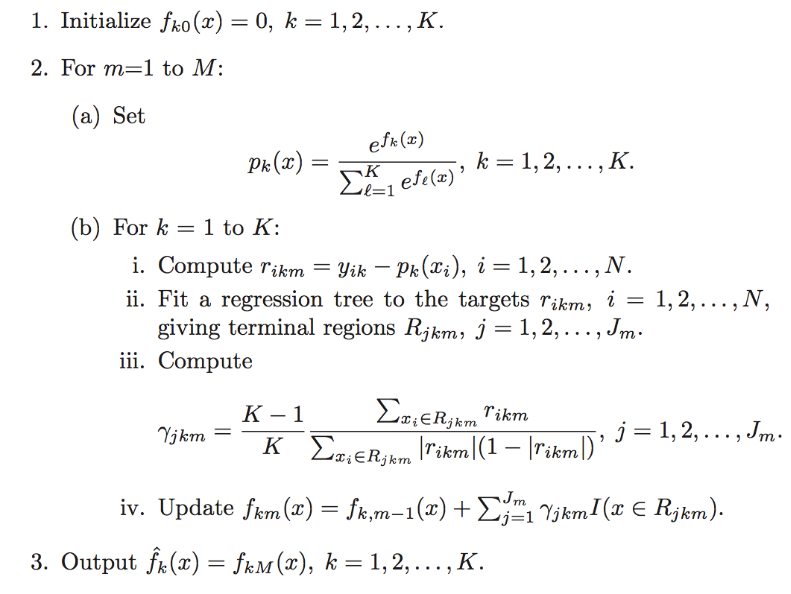

Gradient Boosted Regression and Classification
----------------------------------------------
Gradient boosted regression and gradient boosted classification are forward learning ensemble methods. The guiding principal is that good predictive results can be obtained through increasingly refined approximations. 

Defining a GBM Model
""""""""""""""""""""

**Destination Key:**

  A user defined name for the model. 

**Source**

  The .hex key associated with the parsed data to be used in the model.

**Response**

  The response variable.

**Ignored Columns**

  By default all of the information submitted in a data frame will be used in building the   GBM model. Users specify those attributes that should be omitted from analysis. 

**Classification**

  A tic-box option that, when checked, treats the outcome variable as categorical, and when unchecked treats the outcome variable as continuous and normally distributed. 

**Validation** 

  A .hex key associated with data to be used in validation of the model built using the data specified in **Source**.

**NTrees**

  The number of trees to be built. 

**Max Depth** 

  The maximum number of edges to be generated between the first node and the terminal node. 

**Min Rows** 

  The minimum number of observations to be included in a terminal leaf. If any classification must consist of no fewer than five elements, min rows should be set to five. 

**N Bins**

  The number of bins data are partitioned into before the best split point is determined. A high number of bins relative to a low number of observations will have a small number of observations in each bin. 

**Learn Rate**

  A number between 0 and 1 that specifies the rate at which the algorithm should converge. Learning rate is inversely related to the number of iterations taken for the algorithm to complete. 

Interpreting Results
"""""""""""""""""""""

GBM results are comprised of a confusion matrix and the mean squared error of each tree. 

An example of a confusion matrix is given below:

The highlighted fields across the diagonal indicate the number the
number of true members of the class who were correctly predicted as
true. The overall error rate is shown in the bottom right field. It reflects
the proportion of incorrect predictions overall.  

.. image:: GBMmatrix.png
   :width: 70 %

**MSE**

  Mean squared error is an indicator of goodness of fit. It measures the squared distance between an estimator and the estimated parameter. 

Gradient Boosting Machine: The Data Science of GBM
""""""""""""""""""""""""""""""""""""""""""""""""""

H\ :sub:`2`\ O's Gradient Boosting Algorithm follows the standard set by Hastie et
al:

This example was created in Julia language. For explanatory purposes, we show the initialization (m=0) and first two (m=1,2) passes of gbm with a maximum depth = 1 decision tree on 9 examples of data as shown below in the data frame df. Also there are 3 classes (K=3) in Y: {1,2,3}

::

  LearningRate = 1
  MinObsPerNode=5
  
  import DataFrames

  df = DataFrames.DataFrame()
  df["Y"] = [1,1,1,2,2,3,2,3,3] - 1
  df["X1"] = [1,1,1,2,2,2,3,4,4]
  df["X2"] = [1,1,1,1,1,1,1,1,1]
  K = 3

  I =size(df,1)
  df

Returns: 

::

 9x3 DataFrame:
        Y X1 X2
 [1,]    0  1  1
 [2,]    0  1  1
 [3,]    0  1  1
 [4,]    1  2  1
 [5,]    1  2  1
 [6,]    2  2  1
 [7,]    1  3  1
 [8,]    2  4  1
 [9,]    2  4  1

**Set up the dependent variable Y plus an indicatored version Y_I**
Output: K many 0/1 columns then Y proper

::

  Y = df[:, ["Y"]]
  X = df[:, ["X1", "X2"]]

  Y_I = zeros(I, K);
  for i = 1:K
  Y_I[:,i] = [y == (i - 1) ? 1:0 for y in Y[:,1]];
  end
  [ Y_I Y[:,1] ]

Returns:

::

 9x4 Array{Float64,2}:
 1.0  0.0  0.0  0.0
 1.0  0.0  0.0  0.0
 1.0  0.0  0.0  0.0
 0.0  1.0  0.0  1.0
 0.0  1.0  0.0  1.0
 0.0  0.0  1.0  2.0
 0.0  1.0  0.0  1.0
 0.0  0.0  1.0  2.0
 0.0  0.0  1.0  2.0

**Build a simple, depth 1 only, regression tree; iterate over the
columns to find the minimal squared error.**

::

  # rtree -- for now, depth 1 only
  # residuals is the current residuals
  # X is the set of explanatory variables
  # close over K
  # returns 
  function rtree(residuals, X)
    r = deepcopy(residuals)    
    
    # need the minimum error over all columns
    min_data_err = typemax(Float64)
    min_data_col = -1
    min_data_index = -1
    min_data_split = typemax(Int32)
    for col = 1:size(X,2)
        x = X[:,col]
        p = sortperm(x)
        r = r[p]
        x = x[p]
  
        lsum = r[1]
        rsum = sum(r) - lsum        
        lsumsq = r[1]^2
        rsumsq = sum(r.^2) - lsumsq
        #results = zeros(8,3)
        min_error = typemax(Float64)
        min_index = -1
        rprev = r[1]
        for split_i = 1:length(r) - 1
            lerr = lsumsq - (1/split_i) * lsum^2
            rerr = rsumsq - (1/(length(x) - split_i)) * rsum^2
            err = lerr + rerr
            #results[ split_i, :] = [lerr, rerr, err]
            
            if err < min_error && (x[split_i] != x[split_i+1])
                min_error = err
                min_index = split_i
            end
            
            lsum += r[ split_i + 1 ]
            rsum -= r[ split_i + 1 ]
            t = r[ split_i + 1 ]^2
            lsumsq += t
            rsumsq -= t
        end
        @printf("column %d has min error %f at index %d\n", col, min_error, min_index)
        #print(results)
        
        if (min_error < min_data_err)
            min_data_err = min_error
            min_data_col = col
            min_data_index = min_index
            min_data_split = x[ min_index ]
        end
    end
    
    r = r[ sortperm(X[:,min_data_col]) ];
    s = 1:min_data_index;
    # build gammas
    gammas = zeros(2);
    gammas[1] = sum( r[s] );
    gammas[1] /= sum([ abs(t) * (1-abs(t)) for t in r[s]]);
    s = min_data_index+1:length(r);
    gammas[2] = sum( r[s]);
    gammas[2] /= sum([ abs(t) * (1-abs(t)) for t in r[s]]);
    gammas *= (K-1)/K;
    
    g(x) = x <= min_data_split ? LearningRate * gammas[1] : LearningRate * gammas[2]
    @vectorize_1arg Number g
    f(X) = g(X[:,min_data_col])
    
    
    (min_data_col, min_data_index, min_data_split, gammas, f)
  end

  # some simple test data
  if false
    X=[1 1 1 2 2 2 3 4 4; ]' #[1 for x=1:9]'; 1 1 1 1 1 1 3 4 4; 4 4 3 1 1 1 1 1 1]';
    r=[[2 for x=1:3], [-1 for x=1:6]]/3;
    results = rtree(r, X);
    println(results)
    f = results[5]
    f(X)
  end

**Initialize internal states**
fs is a vector of functions indexed by m
f_m=0(X) = 0
F[I,K] = current value of f_m(x)
P[I,K] = current probabilities / normalized F
R[I,K] = Y_I - P # 2.b.1
displays: F, R

::

  m = 0
  f = function(k, X)  zeros(size(X,1), 1) end
  fs = [f]
  F = zeros(I,K);

**Setup**
set up probs (2.a)
set up the residuals (2.b.i)

::

  m = 1

  P = exp( F );
  P_denom = sum(P,2);
  P = P ./ P_denom;
  # assert: all ones: sum(P, 2), ie, the rowsums of P are always 1.0
  R = Y_I - P;

  [ F P R ]

Returns:

::

 9x9 Array{Float64,2}:
 0.0  0.0  0.0  0.333333  0.333333  0.333333   0.666667  -0.333333  -0.333333
 0.0  0.0  0.0  0.333333  0.333333  0.333333   0.666667  -0.333333  -0.333333
 0.0  0.0  0.0  0.333333  0.333333  0.333333   0.666667  -0.333333  -0.333333
 0.0  0.0  0.0  0.333333  0.333333  0.333333  -0.333333   0.666667  -0.333333
 0.0  0.0  0.0  0.333333  0.333333  0.333333  -0.333333   0.666667  -0.333333
 0.0  0.0  0.0  0.333333  0.333333  0.333333  -0.333333  -0.333333   0.666667
 0.0  0.0  0.0  0.333333  0.333333  0.333333  -0.333333   0.666667  -0.333333
 0.0  0.0  0.0  0.333333  0.333333  0.333333  -0.333333  -0.333333   0.666667
 0.0  0.0  0.0  0.333333  0.333333  0.333333  -0.333333  -0.333333
 0.666667

**Regression tree**
fit an regression tree (2.b.ii)
compute gammas (2.b.iii)
update f (2.b.iv)
compute new F matrix (I by K, current values of f(x))
rtree will output the splitting column plus the decision

::

  #fbackup = f
  #f = fbackup

  let ff = [], g=f
    for k = 1:K
        results = rtree(R[:,k], X)
        println(results)
        f_1 = results[5]
        ff = [ff, f_1]   
    end

    f = function(k,X) ff[k](X) + g(k,X) end
  end
  for k = 1:K
    F[:, k] = f(k,X)
  end
  fs = [fs, f]
  F

column 1 has min error 0.000000 at index 3
column 2 has min error Inf at index -1
(1,3,1,[2.0,-0.9999999999999998],f)
column 1 has min error 1.500000 at index 3
column 2 has min error Inf at index -1
(1,3,1,[-0.9999999999999998,0.5000000000000001],f)
column 1 has min error 0.857143 at index 7
column 2 has min error Inf at index -1
(1,7,3,[-0.5714285714285712,2.0],f)

Returns:

::
 
 9x3 Array{Float64,2}:
  2.0  -1.0  -0.571429
  2.0  -1.0  -0.571429
  2.0  -1.0  -0.571429
 -1.0   0.5  -0.571429
 -1.0   0.5  -0.571429
 -1.0   0.5  -0.571429
 -1.0   0.5  -0.571429
 -1.0   0.5   2.0     
 -1.0   0.5   2.0

**Predict, m=1**

::
  
  preds = [indmax(F[i,:]) for i in 1:size(F,1)]
  [preds Y[:,1]]

  cm = zeros(Int32, K, K)
  for r = 1:size(Y, 1)
   cm[ Y[r,1] + 1, preds[r]] += 1
  end
  println("truth/pred")
  cm
  truth/pred

Returns: 

::

 3x3 Array{Int32,2}:
 3  0  0
 0  3  0
 0  1  2

**Step 2: Setup**
set up probs (2.a)
set up the residuals (2.b.i)

::

 m = 2

 P = exp( F );
 P_denom = sum(P,2);
 P = P ./ P_denom;
 # assert: all ones: sum(P, 2),- ie, the rowsums of P are always 1.0
 R = Y_I - P;

 [ P R ]

Returns:

::

 9x6 Array{Float64,2}:
 0.887931   0.0442075  0.0678613   0.112069   -0.0442075  -0.0678613
 0.887931   0.0442075  0.0678613   0.112069   -0.0442075  -0.0678613
 0.887931   0.0442075  0.0678613   0.112069   -0.0442075  -0.0678613
 0.142516   0.638713   0.218771   -0.142516    0.361287   -0.218771 
 0.142516   0.638713   0.218771   -0.142516    0.361287   -0.218771 
 0.142516   0.638713   0.218771   -0.142516   -0.638713    0.781229 
 0.142516   0.638713   0.218771   -0.142516    0.361287   -0.218771 
 0.0391126  0.17529    0.785597   -0.0391126  -0.17529     0.214403 
 0.0391126  0.17529    0.785597   -0.0391126  -0.17529     0.214403 

**Step 2: Regression tree**
fit an regression tree (2.b.ii)
compute gammas (2.b.iii)
update f (2.b.iv)
compute new F matrix (I by K, current values of f(x))
rtree will output the splitting column plus the decision

::

 #fbackup2 = f
 #f = fbackup2
 let ff = [], g=f
    for k = 1:K
        results = rtree(R[:,k], X)
        println(results)    
        ff = [ff, results[5]]   
    end

    
    f = function(k,X) ff[k](X) + g(k,X) end
 end

 for k = 1:K
    F[:, k] = f(k,X)
 end
 fs = [fs, f]

 P = exp( F );
 P_denom = sum(P,2);
 P = P ./ P_denom;

 [F P]

column 1 has min error 0.014256 at index 3
column 2 has min error Inf at index -1
(1,3,1,[0.7508089035724215,-0.7663178838884337],f)
column 1 has min error 0.791449 at index 7
column 2 has min error Inf at index -1
(1,7,3,[0.198468332941281,-0.8083653449807602],f)
column 1 has min error 0.766832 at index 7
column 2 has min error Inf at index -1
(1,7,3,[-0.0600470420716938,0.8486114856775291],f)

Returns:

::

 9x6 Array{Float64,2}:
  2.75081  -0.801532  -0.631476  0.941064   0.0269685  0.0319677
  2.75081  -0.801532  -0.631476  0.941064   0.0269685  0.0319677
  2.75081  -0.801532  -0.631476  0.941064   0.0269685  0.0319677
 -1.76632   0.698468  -0.631476  0.0630054  0.741005   0.19599  
 -1.76632   0.698468  -0.631476  0.0630054  0.741005   0.19599  
 -1.76632   0.698468  -0.631476  0.0630054  0.741005   0.19599  
 -1.76632   0.698468  -0.631476  0.0630054  0.741005   0.19599  
 -1.76632  -0.308365   2.84861   0.0094093  0.0404332  0.950158 
 -1.76632  -0.308365   2.84861   0.0094093  0.0404332  0.950158 

**Predict, m=2**

::
 
 preds = [indmax(F[i,:]) for i in 1:size(F,1)]
 [preds Y[:,1]]

 cm = zeros(Int32, K, K)
 for r = 1:size(Y, 1)
   cm[ Y[r,1] + 1, preds[r]] += 1
 end
 println("truth/pred")
 cm

truth/pred

Returns

::

 3x3 Array{Int32,2}:
 3  0  0
 0  3  0
 0  1  2

**collapse, m=3**

Reference
"""""""""

Dietterich, Thomas G, and Eun Bae Kong. "Machine Learning Bias,
Statistical Bias, and Statistical Variance of Decision Tree
Algorithms." ML-95 255 (1995).

Elith, Jane, John R Leathwick, and Trevor Hastie. "A Working Guide to
Boosted Regression Trees." Journal of Animal Ecology 77.4 (2008): 802-813

Friedman, Jerome H. "Greedy Function Approximation: A Gradient
Boosting Machine." Annals of Statistics (2001): 1189-1232.

Friedman, Jerome, Trevor Hastie, Saharon Rosset, Robert Tibshirani,
and Ji Zhu. "Discussion of Boosting Papers." Ann. Statist 32 (2004): 
102-107

Friedman, Jerome, Trevor Hastie, and Robert Tibshirani. "Additive
Logistic Regression: A Statistical View of Boosting (With Discussion
and a Rejoinder by the Authors)." The Annals of Statistics 28.2
(2000): 337-407
http://projecteuclid.org/DPubS?service=UI&version=1.0&verb=Display&handle=euclid.aos/1016218223

Hastie, Trevor, Robert Tibshirani, and J Jerome H Friedman. The
Elements of Statistical Learning.
Vol.1. N.p.: Springer New York, 2001. 
http://www.stanford.edu/~hastie/local.ftp/Springer/OLD//ESLII_print4.pdf

