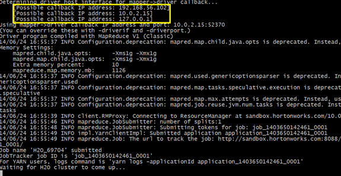

.. _Hadoop_Tutorial:

Running H2O on Hadoop
=====================

**NOTE**: 

- Each H2O node runs as a mapper
- Run only one mapper per host
- There are no combiners or reducers 
- Each H2O cluster must have a unique job name
- `-mapperXmx`, `-nodes`, and `-output` are required
- Root permissions are not required - just unzip the H2O .zip file on any single node

The following tutorial will walk the user through the download or build of H2O and the parameters involved in launching H2O from the command line.

1. Download the latest H2O release:

::

  $ wget http://h2o-release.s3.amazonaws.com/h2o/SUBST_RELEASE_NAME/SUBST_BUILD_NUMBER/h2o-SUBST_PROJECT_VERSION.zip

2. Prepare the job input on the Hadoop Node by unzipping the build file and changing to the directory with the Hadoop and H2O's driver jar files.

::

  $ unzip h2o-SUBST_PROJECT_VERSION.zip
  $ cd h2o-SUBST_PROJECT_VERSION/hadoop

3. To launch H2O nodes and form a cluster on the Hadoop cluster, run:

::

  $ hadoop jar h2odriver_hdp2.1.jar water.hadoop.h2odriver -libjars ../h2o.jar -mapperXmx 1g -nodes 1 -output hdfsOutputDirName

- For each major release of each distribution of Hadoop, there is a driver jar file that is required to launch H2O. Currently available driver jar files in each build of H2O include `h2odriver_cdh5.jar`, `h2odriver_hdp2.1.jar`, and `mapr2.1.3.jar`.

- The above command launches a 1g node of H2O. We recommend you launch the cluster with four times the memory of your data file.

- *mapperXmx* is the mapper size or the amount of memory allocated to each node.

- *nodes* is the number of nodes requested to form the cluster.

- *output* is the name of the directory created each time a H2O cloud is created so it is necessary for the name to be unique each time it is launched.

4. To monitor your job, direct your web browser to your standard job tracker Web UI.
To access H2O's Web UI, direct your web browser to one of the launched instances. If you are unsure where your JVM is launched,
review the output from your command after the nodes has clouded up and formed a cluster. Any of the nodes' IP addresses will work as there is no master node.

Hadoop Launch Parameters
------------------------

- `-libjars <.../h2o.jar>`: Add external jar files; must end with `h2o.jar`. 
- `-h | -help`: Display help 
- `-job name <JobName>`: Specify a job name; the default is `H2O_nnnnn` (where n is chosen randomly)
- `-driverif <IP address of mapper -> driver callback interface>`: Specify the IP address for callback messages from the mapper to the driver. 
- `-driverport <port of mapper -> callback interface>`: Specify the port number for callback messages from the mapper to the driver. 
- `-network <IPv4Network1>[,<IPv4Network2>]`: Specify the IPv4 network(s) to bind to the H2O nodes; multiple networks can be specified to force H2O to use the specified host in the Hadoop cluster. `10.1.2.0/24` allows 256 possibilities.   
- `-timeout <seconds>`: Specify the timeout duration (in seconds) to wait for the cluster to form before failing. 
- `-disown`: Exit the driver after the cluster forms.
- `notify <notification file name>`: Specify a file to write when the cluster is up. The file contains the IP and port of the embedded web server for one of the nodes in the cluster. All mappers must start before the H2O cloud is considered "up". 
- `mapperXmx <per mapper Java Xmx heap size>`: Specify the amount of memory to allocate to H2O. 
- `extramempercent <0-20>`: Specify the extra memory for internal JVM use outside of the Java heap. This is a percentage of `mapperXmx`. 
- `-n | -nodes <number of H2O nodes>`: Specify the number of nodes. 
- `-nthreads <maximum number of CPUs>`: Specify the number of CPUs to use. Enter `-1` to use all CPUs on the host, or enter a positive integer. 
- `-baseport <initialization port for H2O nodes>`: Specify the initialization port for the H2O nodes. The default is `54321`. 
- `-ea`: Enable assertions to verify boolean expressions for error detection. 
- `-verbose:gc`: Include heap and garbage collection information in the logs. 
- `-XX:+PrintGCDetails`: Include a short message after each garbage collection. 
- `-license <license file name>`: Specify the directory of local filesytem location and the license file name.  
- `-o | -output <HDFS output directory>`: Specify the HDFS directory for the output. 

