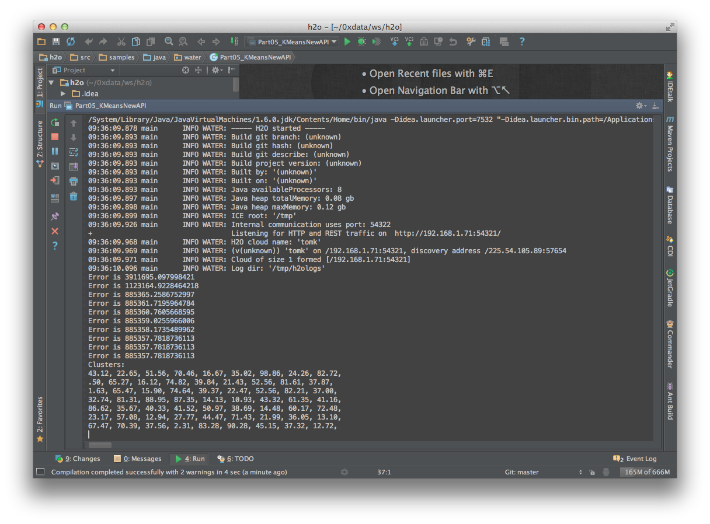

For IDEA users (Github)
----------------------------

1. Create a git clone of the H\ :sub:`2`\ O repository.

 ::
  
  git clone https://github.com/0xdata/h2o.git

.. image:: idea/01FreshGitClone.png
   :width: 90 %

2. Open IDEA.
3. Click Import Project.

.. image:: idea/02ImportProject.png
   :width: 90 %

4. Choose the H\ :sub:`2`\ O directory and click OK.

.. image:: idea/03ChooseH2ODir.png
   :width: 90 %

5. Choose Import project from external model.  Choose Eclipse.  Click Next.

.. image:: idea/04ChooseEclipse.png
   :width: 90 %

6. ENABLE LINK CREATED INTELLIJ IDEA MODULES TO ECLIPSE PROJECT FILES (this is not selected by default).  Click Next.

.. image:: idea/05ConfigureImport.png
   :width: 90 %

7. H\ :sub:`2`\ O should be selected by default.  Keep it selected and click Next.

.. image:: idea/06H2OSelected.png
   :width: 90 %

8. Keep the 1.6 selected by default and click Finish.  SDK 1.7 is also fine if that is the default on your system.

.. image:: idea/07SelectJavaSK.png
   :width: 90 %

9. (Import from Eclipse) If prompted for Python configuration stuff, just click Cancel.

.. image:: idea/08CancelPython.png
   :width: 90 %

10. If prompted to Add Files to Git, just click Cancel.

.. image:: idea/09CancelAddProjectFilesToGit.png
   :width: 90 %

11. Select a sample Java Application and right click on it.  Choose Run.

.. image:: idea/10SelectJavaApplicationToRun.png
   :width: 90 %

12. See the output of a successful run.

