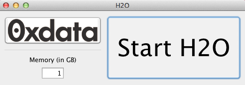

H\ :sub:`2`\ O Getting Started from an Installer Package (Beta)
----------------------------------------------------------------

**Our Quick Installer is now available as a Beta release.  We welcome your feedback.**

From the website below choose download installer for mac or windows as appropriate, and follow the installation helper to install H\ :sub:`2`\ O. 

  http://h2o-release.s3.amazonaws.com/h2o/master/latest.html

An installation helper will guide you through the rest of the installation. 

Click "Start H\ :sub:`2`\ O". After a brief pause, the default web browser will launch, opening to the user interface for H\ :sub:`2`\ O. Further information on using the interface can be found in the User Guide. Algorithm specific tutorials can be found in Tutorials. Both of these can be easily accessed by clicking on the **Help** drop down menu at the top of the page.  

Once H\ :sub:`2`\ O has been installed users can find the application in the installation directory. Double click on the H\ :sub:`2`\ O icon. A simple launcher will open. Clicking on **0xdata** in the upper left corner will take you to the 0xdata documents website, where you can find more information. 

To adjust the amount of memory that is allocated to H\ :sub:`2`\ O, enter the appropriate level of memory in GB. A good guideline for memory allocation is that memory allocation should be 4x the size of your data, but never more than the total amount of memory on your
computer.

   

**IMPORTANT NOTE**
It is important to understand that the H\ :sub:`2`\ O program is using the memory resources of the machine on which it is running. To free those resources, users must return to the H\ :sub:`2`\ O launcher and click the Stop H\ :sub:`2`\ O button. H\ :sub:`2`\ O will continue to run until it is stopped regardless of whether the web based interface is closed. 

