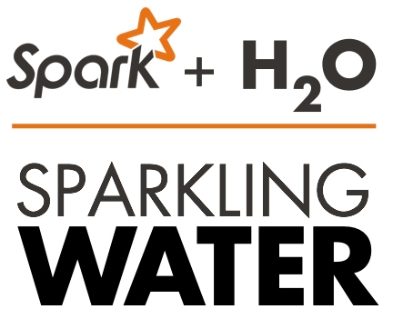

.. _Sparkling_Water:

Sparkling Water
===============

   

Getting Started with Sparkling Water
------------------------------------

- `Sparkling Water Development Documentation <https://github.com/h2oai/sparkling-water/blob/master/DEVEL.md>`_
- `Download Sparkling Water <http://h2o.ai/download/>`_
- `Sparkling Water README <https://github.com/h2oai/sparkling-water/blob/master/README.md>`_
- `Launch on Hadoop and Import From HDFS <https://github.com/h2oai/sparkling-water/tree/master/examples#sparkling-water-on-hadoop>`_
- `Sparkling Water Tutorials <https://github.com/h2oai/sparkling-water/tree/master/examples>`_
    - `Sparkling Water K-Means tutorial <https://github.com/h2oai/sparkling-water/blob/master/examples/src/main/scala/org/apache/spark/examples/h2o/ProstateDemo.scala>`_
    - `Sparkling Water GBM tutorial <https://github.com/h2oai/sparkling-water/blob/master/examples/src/main/scala/org/apache/spark/examples/h2o/CitiBikeSharingDemo.scala>`_
- `Sparkling Water on YARN <http://h2o.ai/blog/2014/11-sparkling-water-on-yarn-example/>`_
- `Building Applications on top of H2O <http://learn.h2o.ai/content/hackers_station/README.html>`_
- `Sparkling Water FAQ <http://h2o.ai/product/faq/#SparklingH2O>`_

---

Blog Posts
----------

- `How Sparkling Water Brings H2O to Spark <http://h2o.ai/blog/2014/09/how-sparkling-water-brings-h2o-to-spark>`_
- `H2O - The Killer App on Spark <http://h2o.ai/blog/2014/06/h2o-killer-application-spark>`_
- `In-memory Big Data: Spark + H2O <http://h2o.ai/blog/2014/03/spark-h2o/>`_

---

Meetup Slide Decks
------------------

- `Sparkling Water Meetup 02/03/2015 <https://github.com/h2oai/sparkling-water/tree/master/examples/scripts>`_
- `Sparkling Water Meetup <http://www.slideshare.net/0xdata/spa-43755759>`_
- `Interactive Session on Sparkling Water <http://www.slideshare.net/0xdata/2014-12-17meetup>`_
- `Sparkling Water Hands-on <http://www.slideshare.net/0xdata/2014-09-30sparklingwaterhandson>`_
- Sparkling Water Meetup 02/03/2015 Slides:
.. raw:: html

    

    <Iframe width=700 height=900 src="../bits/sparkling_water_meetup.pdf" frameborder="0" allowfullscreen></iframe>
     
