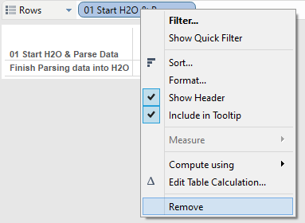
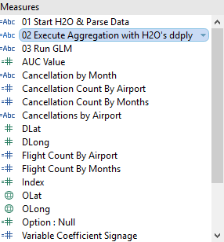

.. _Tableau_8.2:

Tableau 8.2
===========

Have H\ :sub:`2`\ O Installed
"""""""""""""""""""""""""""""

Perquisites :

    - 64-bit Oracle Java 1.6+
    - Tableau 8.1 installed
    - H\ :sub:`2`\ O installed in R (follow download guide :ref:`Rfromdownload`)

Metadata
""""""""

Tableau requires a data input of some sort in order to run but when dealing with immensely big data as a H2O user would
typically do, it is impractical and unnecessarily time consuming to feed all the data into Tableau. So the solution is to
create a small metadata file that can be easily loaded from disk.

Note: in particular, geo attributes like cities and latitude/longitude coordinates need to be imported into Tableau.
Aggregates and calculated fields cannot be converted so even if you have a vector of cities (New York City, San Francisco,
Houston, Austin, Seattle) as a output from R into Tableau as a new measure the user cannot convert the measure into
geographical points.

The metadata is just a file with factor levels of the data frame that’ll give a quick overview of the unique input values
and cardinality of each column. This format will also allow the user to calculate across the table making it easier actually
visualize some of the data coming from H2O. Example: if a column has a 352 categorical values and a binomial GLM is ran with
352 coefficients in the output, Tableau will allow the plotting of the coefficients against the column.

The following data is a truncated metadata file for 116 million rows airline `data set <https://github.com/0xdata/h2o/wiki/Hacking-Airline-DataSet-with-H2O>`_.
This metadata file in particular is only about 352 rows big. A extra column was prepend to the data file to grab the column
names of the actual data set, this column will help populate certain parameters in the workbook.

::

  Colnames  	    Year	Month	DayofMonth	DayOfWeek	UniqueCarrier	Origin	OCity
  Year	            1988	    1           1	1	            PI	        SYR     Syracuse
  Month	            1989	    2	        2	2	            PS      	LGA     New York
  DayofMonth	    1990	    3	        3	3	            TW	        JFK     New York
  DayOfWeek         1991	    4	        4	4	            UA	        UCA     Utica
  DepTime           1992	    5	        5	5	            WN	        CHO     Charlottesville
  CRSDepTime	    1993	    6	        6	6	            EA	        CLT     Charlotte
  ArrTime           1994	    7	        7	7	            HP	        EWR     Newark
  CRSArrTime	    1996	    8	        8		            NW	        LYH     Lynchburg
  UniqueCarrier	    1998	    9	        9		            CO	        ROA     Roanoke
  FlightNum         2000	    10	        10		            DL	        BWI     Baltimore
  TailNum           2001	    11	        11		            AA	        MYR     Myrtle Beach
  ActualElapsedTime 2003	    12	        12		            US	        GSO     Greensboro
  CRSElapsedTime    2004	    	        13		            AS	        ISP     Islip
  AirTime           2005	    	        14		            AQ	        CHS     Charleston
  ArrDelay          2006	    	        15		            MQ	        ORF     Norfolk
  DepDelay          2007	    	        16		            OO	        BGM     Binghamton
  Origin            2008	    	        17		            XE	        LAX     Los Angeles
  Dest                  	    	        18		            EV	        SEA     Seattle
  Distance              	    	        19		            DH	        SJC     San Jose

Create R, Tableau, and Data Connections
"""""""""""""""""""""""""""""""""""""""

**Step 1**

Install Rserve which is the package built to create R servers, and once installed load up the Rserve library and run Rserve or run.Rserve with your desired port.

::

  > install.packages("Rserve")
  > library(Rserve)
  > run.Rserve(port=6311)

**Step 2**

Open Demo_Template_8.1.twb which should have all the calculated fields containing R script already in the sidebar. Navigate to
"Help > Settings and Performance > Manage R Connection" to establish a connection to the R serve

.. image:: tableau_r_connection1.png
   :width: 50%

.. image:: tableau_r_connection2.png
   :width: 50%

**Step 3**

Set the workbook's connection to the airlines_meta.csv data by navigating to the data section on the left sidebar, right clicking
on the airlines_meta and choosing to "Edit Connection." Simply provide the location of the airlines_meta.csv file and submit the new path.

.. image:: tableau_data_connection1.png
   :width: 40%

.. image:: tableau_data_connection2.png
   :width: 40%

**Step 4**

Configure the IP Address and Port that H\ :sub:`2`\ O will launch at as well as the path to the full airlines data file.
Fill in the parameters to creating a new GLM model, for documentation on what the parameters represent visit our GLM documentation page
:ref:`GLMmath`.

.. image:: tableau_h2o_parameters.png
   :width: 40%

Execute Scripts
"""""""""""""""

Move a calculated field under Measures to the worksheet in order to execute the R script in the field:

#. Move "01 Start H2O & Parse Data" to the *Row* shelf which will trigger an execution.

.. image:: tableau_execute3.png
   :width: 40%

#. Right click the field sitting on the *Row* shelf and select Remove to remove it from the worksheet.

#. Repeat this calculated field "02 Execute Aggregation with H2O's ddply" and "03 Run GLM" to finish all the calculations necessary for the dashboard.

Navigate through the worksheets and dashboard
"""""""""""""""""""""""""""""""""""""""""""""

.. image:: tableau_dashboard.png
   :width: 100%