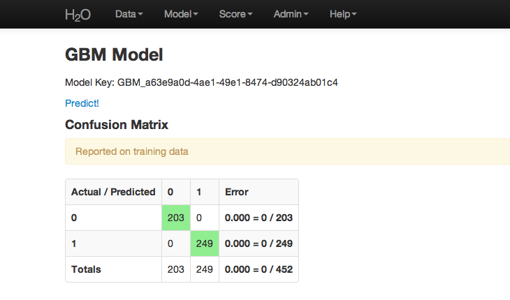

.. _GBM_tutorial:

GBM Tutorial
============

This tutorial walks the new user through a GBM analysis in H2O.

If you have never used H2O before, refer to the quick start guide
for additional instructions on how to run H2O :ref:`GettingStartedFromaZipFile`.

""""""

Getting Started
"""""""""""""""

This tutorial uses a publicly available data set that can be found at:
http://archive.ics.uci.edu/ml/datasets/Arrhythmia

The original data are the Arrhythmia data set made available by UCI
Machine Learning repository. They are composed of 
452 observations and 279 attributes. 

Before modeling, parse data into H2O:

#. From the drop-down **Data** menu, select *Upload* and use the uploader to
   upload data.  

#. On the  "Request Parse" page that appears, check the "header" checkbox if the first row of the data set is a header. No other changes are required. 

#. Click **Submit**. Parsing data into H2O generates a .hex key in the format  "data name.hex"

.. image:: PCAparse.png
   :width: 100%

""""

Building a Model
""""""""""""""""

#. Once data are parsed, a horizontal menu displays at the top
   of the screen reading "Build model using ... ". Select 
   GBM here, or go to the drop down menu Model and
   select GBM. 

#. In the "source" field, enter the .hex key for the Arrhythmia data set. 
 

#. In the "response" list, select the response variable. In this example, it is variable 1.   

#. In the "Ignored Columns" section, select the subset of variables to
   omit from the model. In this example, the only column to 
   omit is the index column, 0. 

#. Select Gradient Boosted Classification by checking the "classification" checkbox or Gradient Boosted Regression by unchecking the "classification" checkbox. GBM is set to classification by default. For this example, the desired output is classification.

#. In the "validation" field, enter the .hex key associated with a holdout (testing)
   data set to apply results to a new data set after the model is generated. 

#. In the "ntrees" field, enter the number of trees to generate. For this example, enter  20. 

#. In the "max depth" field, specify the maximum number of edges between the top
   node and the furthest node as a stopping criteria. For this example, set the depth
   of interaction to 5. 

#. In the "min rows" field, specify the minimum number of observations (rows)
   to include in any terminal node as a stopping criteria. For this example, use 25. 

#. In the "nbins" field, specify the number of bins to use for splitting data. 
   Split points are evaluated at the boundaries of each of these
   bins. As the value for Nbins increases, the more closely the algorithm approximates
   evaluating each individual observation as a split point. The trade
   off for this refinement is an increase in computational time. 

#. In the "learn rate" field, specify a value to slow the convergence of the
   algorithm to a solution and help prevent overfitting. This parameter is also referred to as shrinkage. In this example, enter .3. 

.. image:: GBMrequest.png
   :width: 70%

""""""

GBM Results
"""""""""""

The GBM output for classification displays a confusion matrix with the
classifications for each group, the associated error by group, and
the overall average error. Regression models can be quite complex and
difficult to directly interpret. For that reason, a model key is
given for subsequent use in validation and prediction. 

Both model types provide the MSE by tree. For classification models, the MSE is based on
the classification error within the tree. For regression models, MSE is
calculated from the squared deviances, as with standard regressions. 

""""

