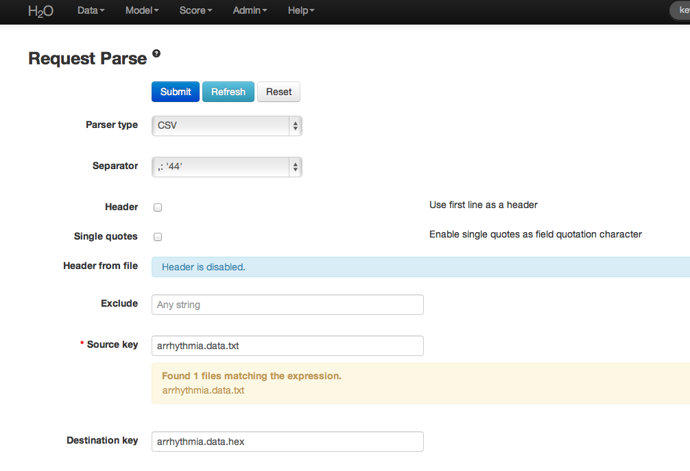
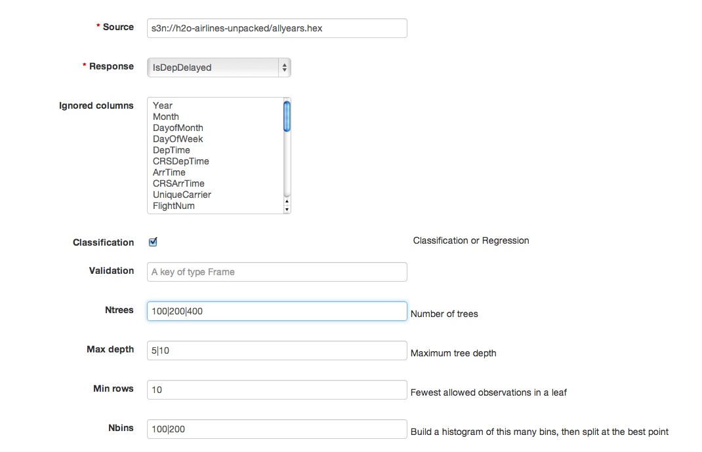
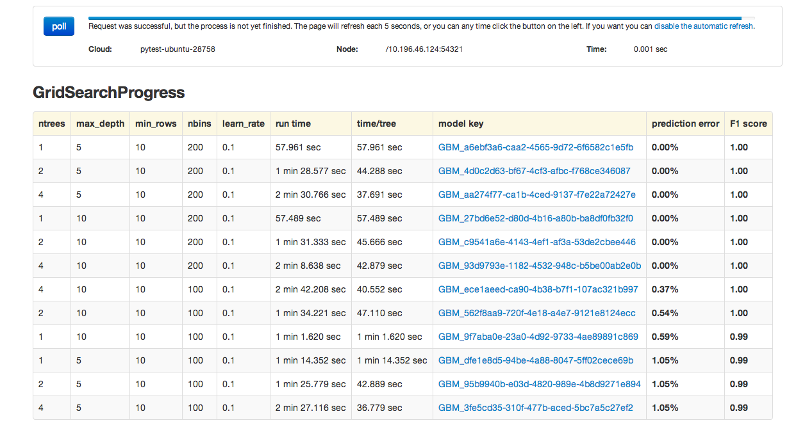

.. _GBM_Grid_tutorial:

GBM Grid Tutorial
------------------

This tutorial walks through a GBM grid analysis. 

If you have never used H2O before, refer to the quick start guide
for additional instructions on how to run H2O: :ref:`GettingStartedFromaZipFile`.

""""

Getting Started
"""""""""""""""

This tutorial uses the Airline data set. This data set and others can be found on the 
H2O page of `Public Data Sets <http://docs.h2o.ai/resources/publicdata.html>`_. 

Before modeling, parse data into H2O:

#. From the drop-down **Data** menu, select *Upload* and use the uploader to
   upload data.  

#. On the  "Request Parse" page that appears, check the "header" checkbox if the first row of the data set is a header. No other changes are required. 

#. Click **Submit**. Parsing data into H2O generates a .hex key with the format  "data name.hex"
   Parsing data should look similar to this:

""""

Building a Model
""""""""""""""""

#. Once data are parsed, a horizontal menu displays at the top
   of the screen reading "Build model using ... ". Select 
   GBM Grid here, or go to the drop-down **Model** menu and
   select *GBM Grid*. 

#. In the "source" field, enter the .hex key for the data set. 
 

#. In the "response" list, select the response variable.    

#. In the "Ignored Columns" section, select the subset of variables to omit from the model. 

#. Select Gradient Boosted Classification by checking the "classification" checkbox or Gradient Boosted Regression by unchecking the "classification" checkbox. GBM is set to classification by default. For this example, the desired output is classification.
 

#. In the "ntrees" field, enter the number of trees to generate. To specify models with different numbers of trees, enter multiple tree counts separated by a pipe (shift + backslash). For example, 50|100|150.

#. In the "max depth" field, specify the maximum number of edges between the top
   node and the furthest node as a stopping criteria. To specify different depths, list the desired depths separated by a pipe (shift + backslash). For example, 2|20|40.  

#. In the "min rows" field, specify the minimum number of observations (rows)
   to include in any terminal node as a stopping criteria. This parameter can also be specified at multiple levels by separating listed levels with a pipe (shift + backslash). For example, 100|20|5.

#. In the "nbins" field, specify the number of bins to use for splitting data. 
   Split points are evaluated at the boundaries of each of these
   bins. As the value for Nbins increases, the more closely the algorithm approximates
   evaluating each individual observation as a split point. The trade
   off for this refinement is an increase in computational time. 

#. In the "learn rate" field, specify a value to slow the convergence of the
   algorithm to a solution and help prevent overfitting. This parameter is also referred to as shrinkage. To specify multiple learning rates, separate the list by a comma. For example, .01,.10,.15.  

""""

Grid Search Results
"""""""""""""""""""

The Grid analysis results display in a table indicating the level at which each of the tuning parameters were tested in combination and a clickable model key for each. If users specify three different levels for Ntrees and four levels for Max Depth, a total of 12 models will be displayed - there is one model for each unique combination of the specified tuning parameters. 
To view details for each of these models, click the model's link that is provided in the results table. 

The GBM output for classification displays a confusion matrix with the
classifications for each group, the associated error by group, and
the overall average error. Regression models can be quite complex and
difficult to directly interpret. For that reason, a model key is
given for subsequent use in validation and prediction. 

Both model types provide the MSE by tree. For classification models, the MSE is based on
the classification error within the tree. For regression models, MSE is
calculated from the squared deviances, as with standard regressions.

""""
