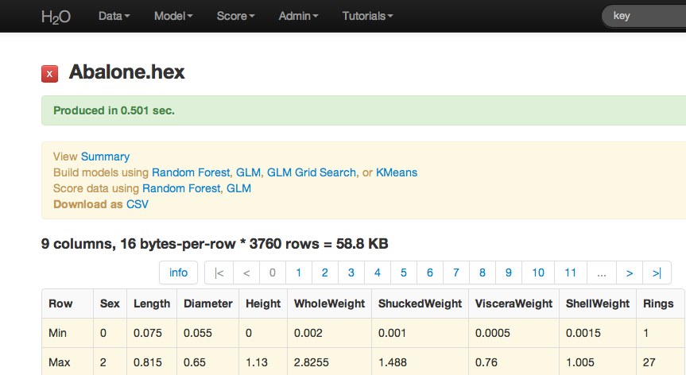

GLM Tutorial
------------

The purpose of this tutorial is to walk the new user through 
a GLM analysis beginning to end. The objective is to  learn how to
specify, run, and interpret a GLM model. 

Those who have never used H\ :sub:`2`\ O before should see the quick
start guide for additional instructions on how to run H\ :sub:`2`\ O.

When to Use GLM
"""""""""""""""
**PREDICTION** The variable of interest relates to predictions or
inferences about a rate, an event, or a continuous
measurement. Questions are about how a set of environmental 
conditions influence the dependent variable. 

Here are some examples: 
  
  "What attributes determine which customers will purchase, and which will not?"

  "Given a set of specific manufacturing conditions, how many units
  produced will fail?"

  "How many customers will contact help support in a given time frame?"

**CLASSIFICATION** The variable of interest is a binomial outcome; a
variable that can be expressed as 0 or 1, a success or a failure.  

Getting Started
"""""""""""""""

This tutorial uses a publicly available data set that can be found at:
http://archive.ics.uci.edu/ml/machine-learning-databases/abalone/ 

The original data are the Abalone data set made available by UCI
Machine Learning repository. They are composed of 4177 observations
and 7 attributes, and have been split into .90/.10 train/ test sets
through random assignment. All attributes are real valued continuous,
except forSex and Rings. Sex is categorical with 3 levels (male,
female, and infant), and Rings is discrete. 

Before modeling, parse data into H\ :sub:`2`\ O as follows:

#. Under the drop down menu **Data** select *Upload* and use the helper to
   upload data.  

#. User will be redirected to a page with the header "Request
   Parse". Select whether the first row of the data set is a
   header. All other settings can be left in default. Press Submit. 

#. Parsing data into H\ :sub:`2`\ O generates a .hex key ("data name.hex")

For this tutorial two data sets will need to be parsed: the testing
set and the training set. Split your data appropriately and parse them
both now. 

.. image:: GLMparse.png
   :width: 80%

After parsing:

Building a Model
""""""""""""""""

#. Once  data are parsed a horizontal menu will appear at the top
   of the screen reading "Build model using ... ". Select 
   GLM here, or go to the drop down menu Model and
   select GLM. 

#. In the Key field enter the .hex key for the training data set. 

#. In the Y field select the column associated with the Whole Weight variable. 

#. In the X field select the columns associated with Sex, Length,
   Diameter, Height, and Rings. 

#. Specify Family to be Gaussian, which automatically sets the link
   field to identity. 

#. Leave lambda and alpha at default (to find detailed information on the
   specificaiton of tuning parameters see the user guide under
   algorithms in the documentation menu). 

#. Leave n-folds at 10. 

#. Select the box marked expert settings, and turn standardization
   OFF. 

.. image:: GLMrequest.png
   :width: 90%

Additional specification detail

.. image:: GLMrequest2.png
   :width: 90%

GLM Results
"""""""""""

GLM output includes coefficients (as well as normalized coefficients when
standardization is requested). Also reported are AIC and
error rate. A specification of the model is printed across the top
of the GLM results page in red. 

Users should note that if they wish to replicate results between H\ :sub:`2`\ O
and R, it is recommended that standardization and cross validation
either be turned off in H\ :sub:`2`\ O, or specified in R. 

.. image:: GLMoutput.png
   :width: 90%

Validating on Testing Set
"""""""""""""""""""""""""

#. At the top of the GLM results page is a horizontal menu titled
   Actions. Select Validate on another dataset. This same action can
   be completed by going to the Score drop down menu and selecting
   GLM.
 

#. In model key enter the .hex key found in the center of the GLM
   results page under the header Validations (this can also be found
   under the Admin drop down menu by selecting Jobs). 

#. In the Key field enter the .hex key associated with the testing
   data set (originally parsed at the beginning of the session). Press
   submit. 

.. image:: GLMvrequest.png
   :width: 90%

Validation results report models statistics like those originally
generated when the model was built. It should give users an idea of
how well their model predicts. 

.. image:: GLMvresults.png
   :width: 100%

THE END. 

