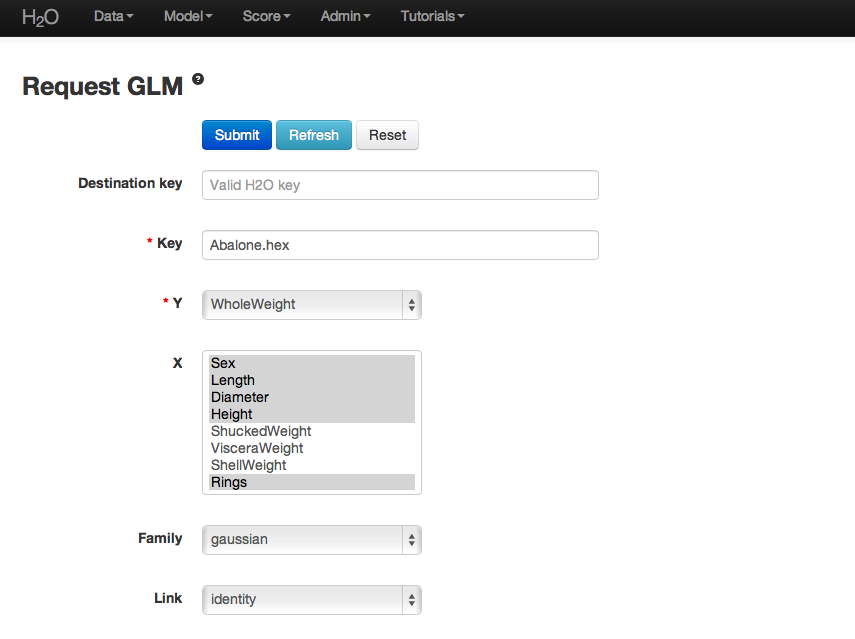
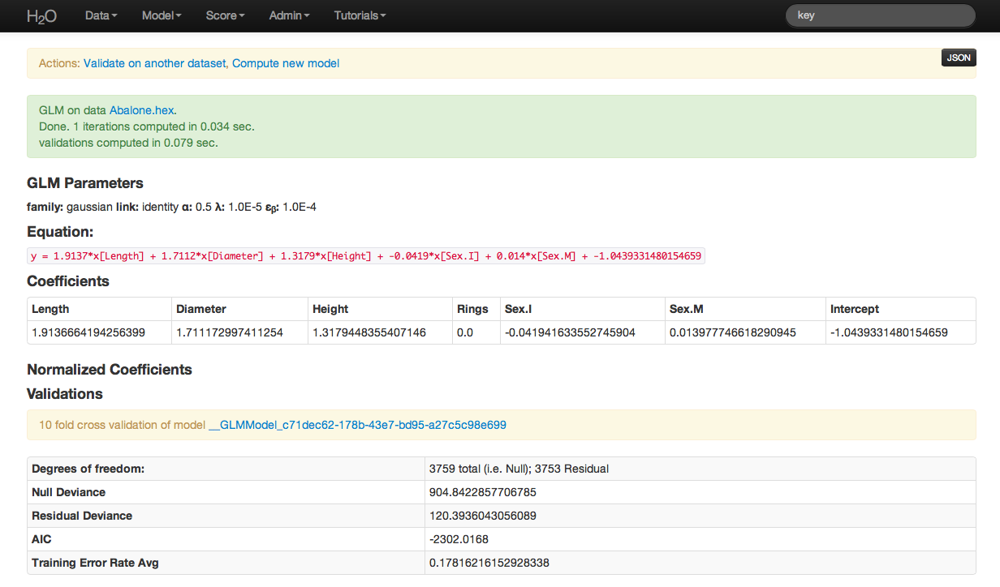

.. _GLM_tutorial:

GLM Tutorial
============

This tutorial walks new users through 
Generalized Linear Analysis (GLM)  using   H2O.  
If you have never used H2O before, refer to
:ref:`GettingStartedFromaZipFile` for additional instructions on how
to run H2O.

""""

Quick Start Video
"""""""""""""""""

.. raw:: html

  <object width="425" height="344"><param name="movie" value="http://www.youtube.com/v/iRqQVA33l0g&hl=en&fs=1"></param><param name="allowFullScreen" value="true"></param><embed src="http://www.youtube.com/v/iRqQVA33l0g&hl=en&fs=1" type="application/x-shockwave-flash" allowfullscreen="true" width="425" height="344"></embed></object>

""""""""

When to Use GLM
"""""""""""""""
Use GLM when the variable of interest relates to predictions or
inferences about a rate, an event, or a continuous 
measurement, or to answer questions about how a set of environmental 
conditions influence the dependent variable. 

For example: 
  
  - What attributes determine which customers will purchase, and which will not?

  - Given a set of specific manufacturing conditions, how many units produced will fail?

  - How many customers will contact help support in a given time frame?

""""""""

Getting Started
"""""""""""""""
This tutorial uses a publicly available data set (Abalone) that can be found at the UCI Machine Learning Repository: http://archive.ics.uci.edu/ml/machine-learning-databases/abalone/ 

They are composed of 4177 observations on
9 attributes. All attributes are real-valued and continuous,
except for Sex and Rings (found in columns 0 and 8, respectively). 
Sex is categorical with 3 levels (male, female, and infant), and Rings
is an integer-valued count. 

Before modeling, parse data into H2O: 

#. From the drop-down **Data** menu, select *Upload*, and use the uploader to
   upload data.  

#. On the  "Request Parse" page that appears, check the "header" checkbox if the first row of the data set is a header. No other changes are required. 

#. Click **Submit**. Parsing data into H2O generates a .hex key of the form  "data name.hex"
 

.. image:: GLMparse.png
   :width: 100%

""""""""""""""""""""""

Building a Model
""""""""""""""""

#. Once data are parsed, a horizontal menu displays at the top
   of the screen reading "Build model using ... ". Click the **Generalized Linear Modeling** link here, or click the drop-down **Model** menu and select **Generalized Linear Model**.

#. In the **Source** field, enter the .hex key for the Abalone data set, if it is not already entered. 

#. From the drop-down **Response** list, select the column associated with the Whole Weight variable (`C5`). 

#. In the **Ignored Columns** field, select the columns to ignore. For this example, select `C6, C7,` and `C8`. 

#. From the drop-down **Family** list, select *Gaussian*. 

#. Confirm the value for **Tweedie Variance Power** is zero. This option is only used for the Tweedie family of GLM models (like zero-inflated Poisson). 

#. To disable cross-validation, enter 0 in the **Nfolds** field. If the Nfolds value is greater than 0, the GLM model displays the specified  number of cross-validation models. 

#. In the **Alpha** field, enter .3. The alpha parameter is the mixing
   parameter for the L1 and L2 penalty.

#. In the **Lambda** field, enter .002.

#. Confirm the **Standardize** option is not checked (disabled). 

#. Do not change the default **Max Iter** value. Classification is
   used when the dependent variable is a binomial classifier. "Max iter"
   defines the maximum number of iterations performed by the algorithm in the event that it fails to converge. 

#. Click **Submit**. 

""""

GLM Results
"""""""""""

The GLM output includes coefficients, AIC, and error rate, as well as normalized coefficients when standardization is requested.  An equation of the specified model displays in red at the top of the GLM results page. 

""""

Validating on Testing Set
"""""""""""""""""""""""""

Models can be applied to holdout testing sets or prediction data, provided that the data are in the same format as the data originally used to generate the GLM model. 

**Note:** If the models used for prediction have lambda search enabled, ~100 submodels are generated. To score a specific lambda value, select a lambda from the lambda row in the "Parameters" table at the top of the page. By default, H2O selects the "best" lambda value, which appears in bold in the lambda row in the "Parameters" table.

If you select a different lambda value, the page refreshes and the selected lambda appears in bold. If you click the **Predict!** link at the top of the page, the selected lambda is used for the prediction. However, if you select **Score** > **Predict**, the default "best" lambda value is used, *not* the selected value. To store the selected lambda value as the "best" value, click the *Set lambda_value to current value!* link.   

#.  Click the **Predict!** link at the top of the GLM results page, or go to the drop-down **Score** menu and select *Predict*.
 

#. If you clicked the **Predict!** link on the GLM results page, the model .hex key is entered automatically. Otherwise, enter the model .hex key in the "model" field. 

#. In the "data" field, enter the .hex key of the test data set and click **Submit**.  

Validation results report the same model statistics that were generated when the model was originally specified.

.. image:: GLMvresults.png
   :width: 100%

""""""

