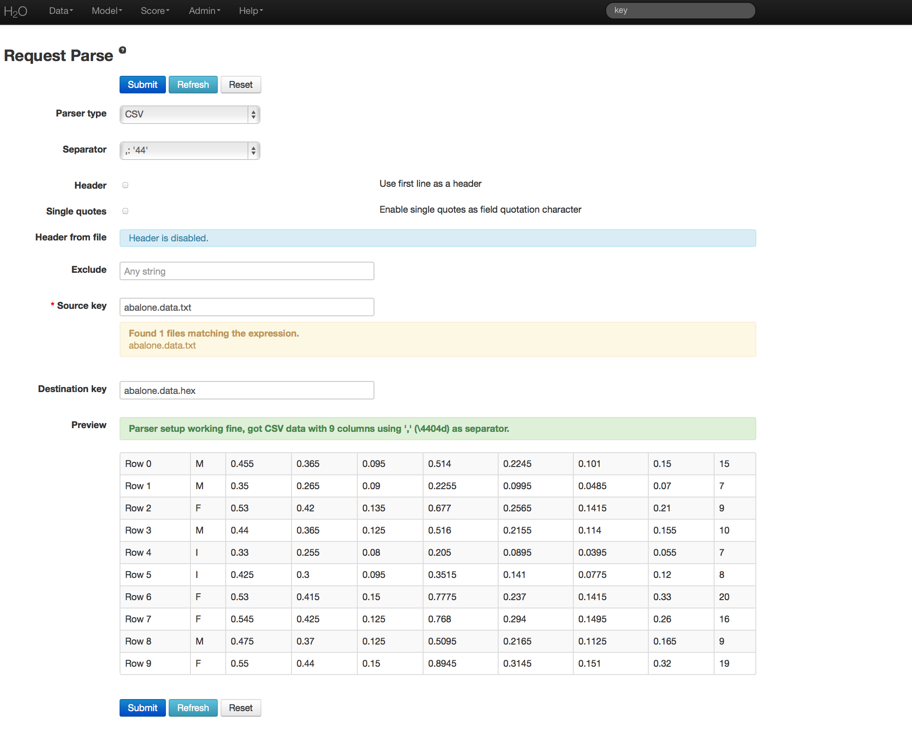
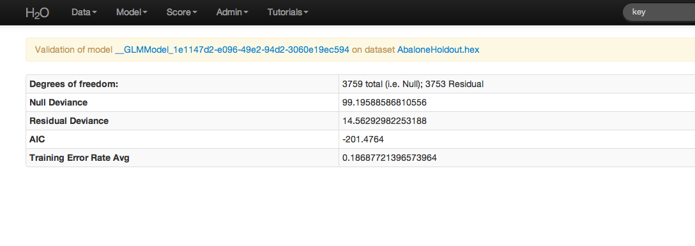

.. _GLMgrid_tutorial:

GLM Grid Tutorial
-------------------

This tutorial walks the new user through a GLM grid analysis, describing how to specify, run, and interpret a GLM grid model using H2O.  
Specification of GLM grid models is similar to creating GLM models, and all
parameters and results have the same meaning. The primary difference
between GLM and GLM Grid is that you can specify several different
models and generate the specified models simultaneously. For more
information, refer to the GLM tutorial :ref:`GLM_tutorial`

If you have never used H2O before, refer to the quick
start guide for additional instructions on how to run H2O :ref:`GettingStartedFromaZipFile`

""""

When to Use GLM Grid
"""""""""""""""""""""
Use GLM Grid if the variable of interest relates to predictions or
inferences about a rate, an event, or a continuous
measurement, or to answer questions about how a set of environmental 
conditions influence the dependent variable when the error rates in prediction are likely to be sensitive to the degree of regularization applied, or specified thresholds. 

Here are some examples: 
  
  - What attributes determine which customers will purchase, and which will not?

  - Given a set of specific manufacturing conditions, how many units produced will fail?

  - How many customers will contact help support in a given time frame?

  - Given a set of conditions, which units will fail? 

""""
 
Getting Started
"""""""""""""""
This tutorial uses a publicly-available data set that can be found at:

http://archive.ics.uci.edu/ml/machine-learning-databases/abalone/ 

The original data are the Abalone data set made available by UCI
Machine Learning repository. They are composed of 4177 observations of
9 attributes. All attributes are real valued continuous,
except for Sex and Rings (found in columns 0 and 8 respectively). 
Sex is categorical with 3 levels (male, female, and infant), and Rings
is integer-valued. 

Before modeling, parse data into H2O as follows:

#. From the drop-down **Data** menu, select *Upload*, and use the uploader to
   upload data.  

#. On the  "Request Parse" page that appears, check the "header" checkbox if the first row of the data set is a header. No other changes are required. 

#. Click Submit. Parsing data into H2O generates a .hex key of the form  "data name.hex"
 

""""

Building a Model
""""""""""""""""

#. Once data are parsed, a horizontal menu appears at the top
   of the screen reading "Build model using ... ". Select 
   **Generalized Linear Model**, or go to the drop down menu **Model** and
   select GLM. 

#. In the "source" field, enter the .hex key for the data set. 

#. From the drop-down "response" list, select the column associated with the Whole Weight
   variable (column 5). 

#. In the "Ignored Columns" area, select the columns associated with Sex, Length,
   Diameter, Height, and Rings (all other columns). 

#. Select "gaussian" from the drop-down "family" list. 

#. "Lambda" and "alpha" are the parameters that determine the 
   regularization of GLM models. To find detailed information on the
   specification of tuning parameters, refer to the data science
   documentation on GLM :ref:`GLMmath`. In GLM Grid specification, specify a range of values by entering the values as a
   comma-separated list (for example: 0.001, 0.01, 0.1, 1 will produce
   models at each of the four specified levels). The same syntax holds
   for alpha and threshold specification.

#. Confirm the value for "n-folds" is 10. This will produce 10 cross-validation models
   for each unique combination of the specified parameters.

#. Confirm that the "standardization" checkbox is checked. This option displays two sets of coefficients: the non-standardized coefficients and the standardized coefficients.  

.. image:: GLMgridrequest.png
   :width: 90%

""""

GLM Grid Results
"""""""""""""""""

The GLM grid output includes a table of the specified models, along with
each model's corresponding specification values. View individual models by clicking the active link for each model. 
The AIC and error rate display for each model's coefficients (as well as normalized coefficients when standardization is enabled). An equation of the specified model displays in red at the top of the GLM results page. 

.. image:: GLMgridoutput1.png
   :width: 90%

**Individual model results**

.. image:: GLMgridoutput2.png
   :width: 90%

""""

Validating on Testing Set
"""""""""""""""""""""""""
Models can be applied to holdout testing sets or prediction data, provided that the data are in the same format as the data originally used to generate the GLM model. 

**Note:** If the models used for prediction have lambda search enabled, ~100 submodels are generated. To score a specific lambda value, select a lambda from the lambda row in the "Parameters" table at the top of the page. By default, H2O selects the "best" lambda value, which appears in bold in the lambda row in the "Parameters" table.

If you select a different lambda value, the page refreshes and the selected lambda appears in bold. If you click the **Predict!** link at the top of the page, the selected lambda is used for the prediction. However, if you select **Score** > **Predict**, the default "best" lambda value is used, *not* the selected value. To store the selected lambda value as the "best" value, click the *Set lambda_value to current value!* link.   

#.  Click the **Predict!** link at the top of the GLM results page, or go to the  drop-down **Score** menu and select *Predict*.
 

#. If you clicked the **Predict!** link on the GLM results page, the model .hex key is entered automatically. Otherwise, enter the model .hex key in the "model" field. 

#. In the "data" field, enter the .hex key of the test data set and click **Submit**.  

#. For regression models, click the **Score** menu and select *Confusion Matrix*. For binomial models, click the **Score** menu and select *AUC*.

#. In the "actual" field, enter the .hex key for the test data set. 

#. From the drop-down "vactual" list, select the column to use for prediction.

#. In the "predict" field, enter the .hex key for the prediction generated in the first step. 

#. From the drop-down "vpredict" list, select *predict*.

#. Click **Submit**. 

""""

