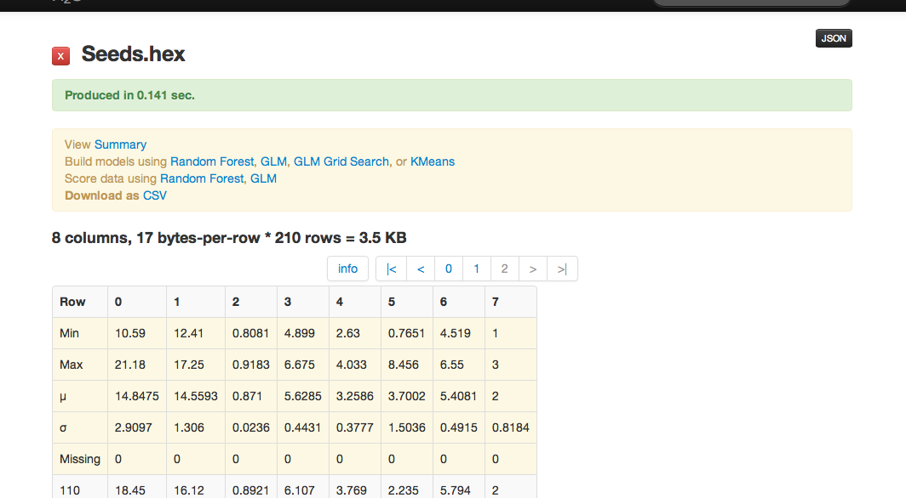
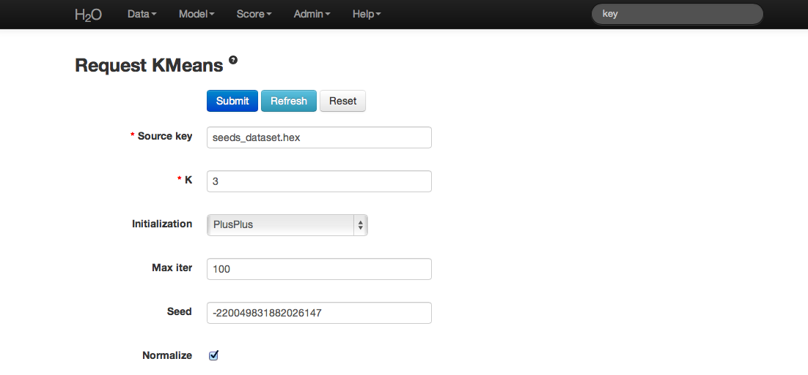
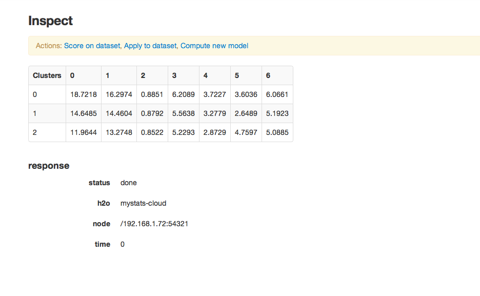
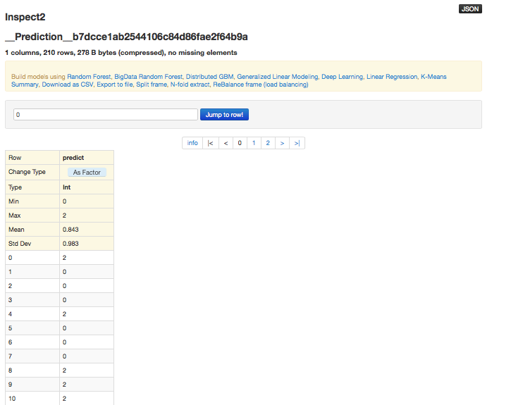

.. _KM_tutorial:

K Means Tutorial
================

This tutorial walks through a K-Means analysis and describes how to specify, run, and interpret a K-means model in  H2O.

If you have never used H2O before, refer to the quick start guide
for additional instructions on how to run H2O: :ref:`GettingStartedFromaZipFile`. 

Interested users can find details on the math behind K Means at: :ref:`KMmath`.

""""

Quick Start Video
"""""""""""""""""

.. raw:: html

  <object width="420" height="315"><param name="movie" value="http://www.youtube.com/v/KVeKfoMRMyQ?version=3&amp;hl=en_US"></param><param name="allowFullScreen" value="true"></param><param name="allowscriptaccess" value="always"></param><embed src="http://www.youtube.com/v/KVeKfoMRMyQ?version=3&amp;hl=en_US" type="application/x-shockwave-flash" width="420" height="315" allowscriptaccess="always" allowfullscreen="true"></embed></object>
  
""""""""""""""  

Getting Started
"""""""""""""""

This tutorial uses a publicly available data set that can be found at http://archive.ics.uci.edu/ml/datasets/seeds

The data are composed of 210 observations, 7 attributes, and an a priori
grouping assignment. All data are positively valued and
continuous. Before modeling, parse data into H2O:

#. From the drop-down **Data** menu, select **Upload** and use the helper to
   upload data.

 
#. On the  "Request Parse" page that appears, check the "header" checkbox if the first row of the data set is a header. No other changes are required. 

#. Click **Submit**. Parsing data into H2O generates a .hex key of the form  "data name.hex"

""""""

Building a Model
""""""""""""""""

#. Once  data are parsed, a horizontal menu appears at the top
   of the screen that displays "Build model using ... ". Select 
   K Means here, or go to the drop-down **Model** menu and
   select K-Means.

#. In the "source" field, enter the .hex key associated with the
   data set. 
   
   
#. Select an option from the "Initialization" drop-down list. For this example, select **PlusPlus**. 
	
   - Plus Plus initialization chooses one initial center at random and weights the random selection of subsequent centers so that points furthest from the first center are more likely to be chosen. 
   - Furthest initialization chooses one initial center at random, and then chooses the next center to be the  point furthest away in terms of Euclidean distance. 
   - The default ("None") results in K initial centers being chosen independently at random.  

#. Specify a value for "k." For this dataset, use 3.  

#. Enter a "Max Iter" (short for maximum iterations) value to specify the maximum number of iterations the algorithm processes.

#. Check the "normalize" checkbox to normalize data, but this is not required for this example. 

#. Click **Submit**.

""""""

K-Means Output
""""""""""""""

The output is a series of table that contain: 

- the cluster centers (in terms of the originally selected attributes)
- cluster sizes
- cluster variances
- overall totals (the total within the cluster sum of squares)

To view the cluster assignments by observation, click the **View the row-by-row cluster assignments**. 

K-Means randomly chooses starting points and converges on 
optimal centroids. The cluster number is arbitrary and should
be thought of as a factor. 

""""""

K-means Predictions
"""""""""""""""""""

To make a prediction based on the model, click the **model Parameters** button. Copy the `destination_key` for the model, then click the drop-down **Score** menu. Select **Predict**, then paste the copied `destination_key` in the **model** field. Type the name of the seeds dataset in the **data** entry field. When you begin typing, the fields will auto-complete; press the arrow keys to select the correct entry and press the Enter button to confirm. To generate the prediction, click the **Submit** button. 

The prediction results display in a two-column table. The first column represents the number of rows assigned to each cluster and the second row contains the squared error per cluster. 

""""""

