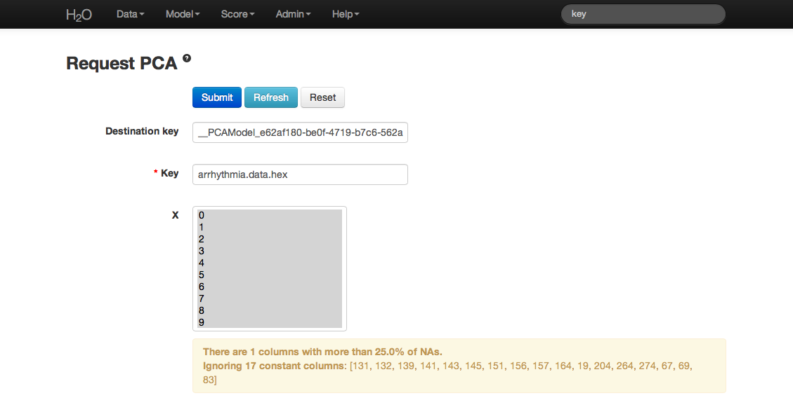
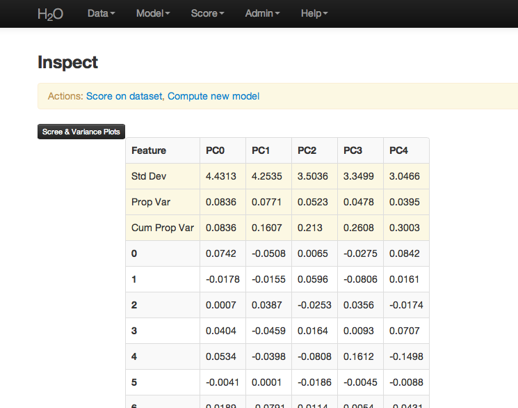

.. _PCATutorial:

PCA Tutorial
===============

This tutorial describes how to perform a PCA analysis in H2O. 

If you have never used H2O before, refer to the quick start guide
for additional instructions on how to run H2O: :ref:`GettingStartedFromaZipFile`.

""""

When to Use PCA
"""""""""""""""
Use PCA to reduce dimensions and solve issues of multicollinearity in high dimension data. 

""""""

Getting Started
"""""""""""""""

This tutorial uses a publicly available data set that can be found at:
http://archive.ics.uci.edu/ml/datasets/Arrhythmia

The original data are the Arrhythmia data set made available by UCI
Machine Learning Repository. They are composed of 452 observations and
279 attributes. 

Before modeling, parse data into H2O:

#. From the drop-down **Data** menu, select *Upload* and use the uploader to
   upload data.  

#. On the  "Request Parse" page that appears, check the "header" checkbox if the first row of the data set is a header. No other changes are required. 

#. Click **Submit**. Parsing data into H2O generates a .hex key of the form  "data name.hex" 

.. image:: PCAparse.png
   :width: 70%

""""""

Building a Model
""""""""""""""""

#. Click the the drop-down **Model** menu and select *PCA*. 

#. In the **source** field, enter the .hex key for the Arrhythmia data set. 
 

#. In the "Ignored Columns" field, select the set of columns to 
   omit from the analysis. For this example, do not select any columns.  
   
   **Note**: PCA ignores categorical variables and constant columns. Categoricals can be included by expanding the categorical into a set of binomial indicators.  

#. To specify the maximum number of principal components to
   be returned, enter a value in the **max pc** field. For this example, enter `100`.  

#. To omit components exhibiting low standard deviation (which indicates a lack of contribution to the overall variance observed in the data), enter a value in the **tolerance** field. For this example, enter `.5`.

#. To standardize, check the "standardize" checkbox. Standardizing is highly
   recommended; if you do not use standardization, the results can include components
   that are dominated by variables that appear to have larger
   variances relative to other attributes purely as a matter of scale,
   rather than true contribution. 

#. To generate the model, click the **Submit** button. 

""""

PCA Results
"""""""""""

The PCA output displays a table with the number of components
indicated by the most restrictive criteria for this
particular case. In this example, a maximum of 100 components are
requested and tolerance is .5.  

The output also include scree and cumulative variance plots for the components.  To view this information, click the black button labeled
"Scree and Variance Plots" at the top left of the results page. A
scree plot shows the variance of each component, while the cumulative
variance plot shows the total variance accounted for by the set of 
components. 

**Note**: To replicate results between H2O and R, we recommend disabling standardization and cross validation in H2O, or specifying the values in R. 

""""

