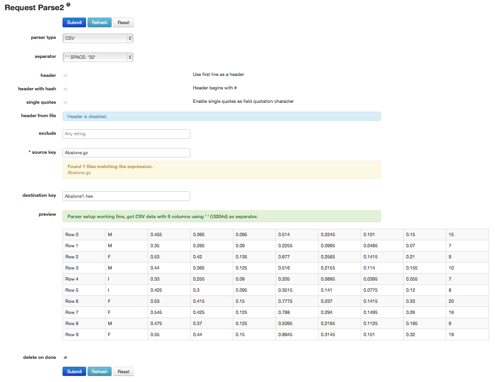
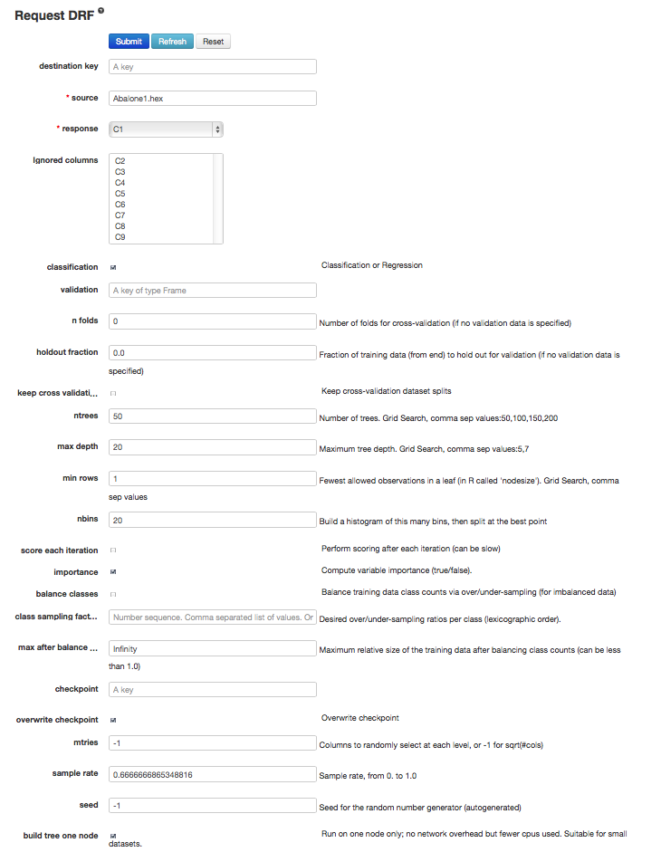
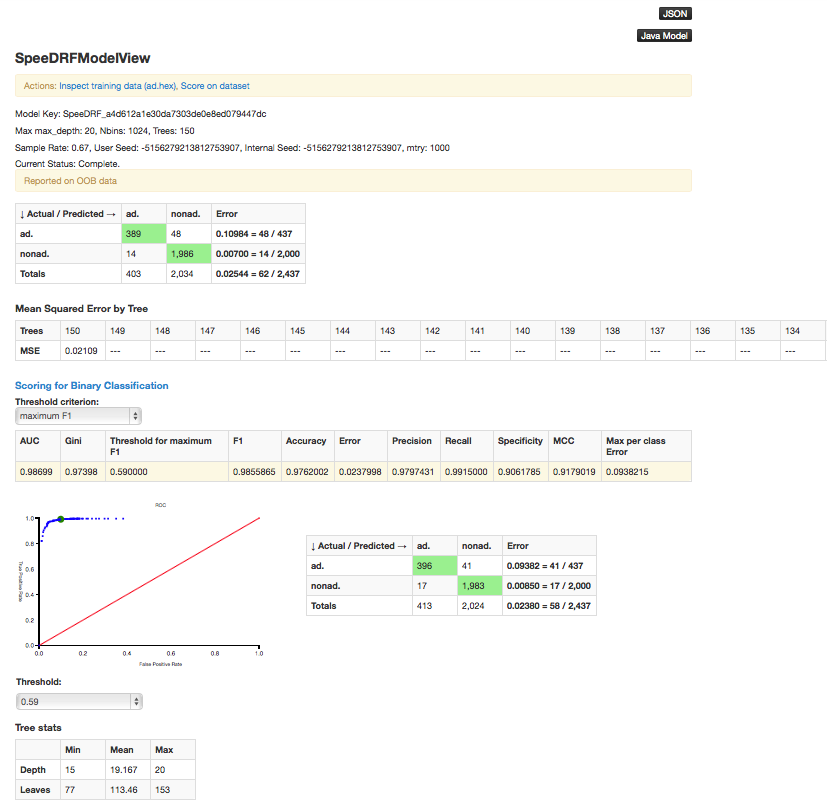

.. _RF_tutorial:

Random Forest Tutorial
----------------------

This tutorial walks through a Random Forest analysis and describes how to specify, run, and interpret Random Forest.

If you have never used H2O before, refer to the quick start guide
for how to run H2O on your computer: :ref:`GettingStartedFromaZipFile`. 

""""

Getting Started
"""""""""""""""

This tutorial uses a publicly-available Internet ads data set that can be found at  http://archive.ics.uci.edu/ml/machine-learning-databases/internet_ads/ 

The data are composed of 3279 observations, 1557 attributes, and an a
priori grouping assignment. The objective is to build a prediction
tool that predicts whether an object is an internet ad or not.
 

#. From the drop-down **Data** menu, select **Upload** and use the uploader to
   upload data.
 
#. The "Request Parse" page appears. If first row of the data set is a
   header, check the "header" checkbox.  No other changes are required.  

#. Click **Submit**. Parsing data into H2O generates a .hex key ("data name.hex").

""""

Building a Model
""""""""""""""""

After parsing the data, select either **Random Forest** or **BigData Random Forest** from the **Build models using...** links at the top of the page. 
Select **Random Forest** to create a SpeeDRF model for classification, or select **BigData Random Forest** a DRF model that can be either classification or regression. 

#. Once data are parsed a horizontal menu appears at the top
   of the screen that displays "Build model using ... ". Select 
   *Random Forest* here, or go to the drop-down **Model** menu and
   find *Random Forest* there.

#. In the **source** field, enter the .hex key generated during data parsing if it is not already entered. 

#. From the drop-down **response** list, select the last column (`C1559`). 

#. In the **ntrees** field, specify the number of trees to build (in this case, `150`).

#. In the **mtries** field, specify the number of features on which the trees will
   split. For this example, enter `1000`. 

#. Specify the maximum distance from root to terminal
   node in the **max depth** field. For the example, use the default value of 20.  

#. To choose between split criteria, make a selection from the drop-down **select stat type** list. Entropy maximizes information gain, while Gini seeks to isolate the dominant category at each node. For this example, select **GINI**. 

#. To correct unbalanced data, select a sampling strategy (random) from the drop-down **sampling strategy** list and check the **balance classes** checkbox. For this example, use the default values.

#. Specify the proportion of observations sampled when building any given tree in the "sample rate" field. The omitted observations are run down the tree, and the classification error rate of that tree is estimated using the error rate from this holdout set. For this example, use the default value. 

#. To generate the model, click the **Submit** button. 

""""

RF Output
"""""""""

The RF output is a confusion matrix detailing
the classification error rates for each level in the range of the
target variable. In addition to the confusion matrix, the mean squared error by tree, AUC, accuracy, error rate, precision, and max per class error ratios are included. A chart displays the data visually, and the tree statistics (min, mean, and max for the tree depth and number of leaves) are also displayed. 

""""

RF Predict
""""""""""

To generate a prediction, click the *Score on dataset* link at the top
of the RFView page or go to the drop-down **Score** menu and select *Predict*. 

The predict function requires a .hex key associated with a model. If you click the *Score on dataset* link, the model key is entered automatically. If you select **Score**>*Predict*, the model .hex key must be entered manually. 
To find the .hex key, go to the drop-down **Admin** menu and select *Jobs*.

|

.. image:: DropdownAdmin.png
   :width: 90 %

.. image:: Jobspage.png
   :width: 100 %

|

All jobs created in the current instance of H2O are listed
here. Find the appropriate job (in this example, "Random Forest 150
Trees"). Save the associated key to clipboard, and paste it into the
model key field on the "Request Generate Predictions" Page. Enter a .hex
key associated with a parsed data set other than the one used to build
the model. To generate the prediction, click the **Submit** button.

|

.. Image:: RFpredict.png
   :width: 90 %

""""
