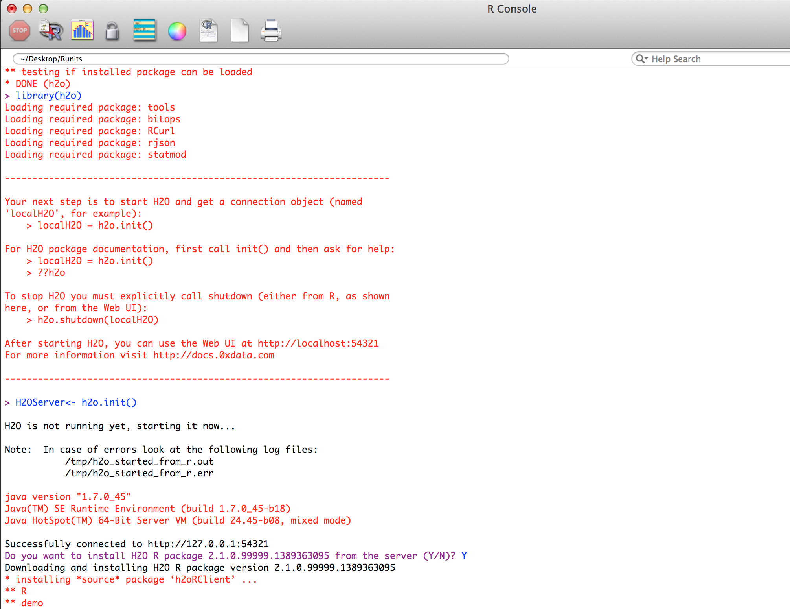

.. -*- mode: rst -*-

.. _R_tutorial:

R Tutorial
-------------

The purpose of this tutorial is to walk the new user through 
examples demonstrating the use of H2O through R.  The objective is to  
learn the basic syntax of H\ :sub:`2`\ O, including importing and 
parsing files, specifying a model, and obtaining model output. 

Those who have never used H\ :sub:`2`\ O before should see the quick
start guide for additional instructions on how to run H\ :sub:`2`\ O. 
Additionally, users who are using H\ :sub:`2`\ O through R for the
first time will need to install the R package, available in our
download package at: http://0xdata.com/downloadtable/. 

**It is highly recommended that users review the getting started section
before proceeding to other sections for examples. At a minimum users
should run the following commands before running any other examples,
as the h2o library and h2o object (named “localH2O” in examples is
required in R for most examples to work.**

::

  library(h2o)
  localH2O = h2o.init(ip = "localhost", port = 54321, startH2O = TRUE, 
     silentUpgrade = TRUE, promptUpgrade = FALSE)

In this tutorial you can find information on: 
Getting Started (establishing a connection between H2O and R),
Importing Data, Data Manipulation, Running Models, Obtaining
Predictions, Other Useful Functions. 

Getting Started
"""""""""""""""

**Installing and Starting H2O**

  Before beginning, be sure to have an instance of H\ :sub:`2`\ O
  running. Additionally, users who are using H\ :sub:`2`\ O for the
  first time can find help for installing the R package at 
  http://docs.0xdata.com/Ruser/Rh2opackage.html. 

  **Step 1**

  Call the H\ :sub:`2`\ O package, and initialize H\ :sub:`2`\ O
  in R. Note that an object “localH2O” is created. Assigning the
  H\ :sub:`2`\ O initialization to an object is important, because the
  connection will be used later to tell R where to send data sets, model
  specification, and where to find results.  

::

  library(h2o)
  localH2O<- h2o.init(ip = "localhost", port = 54321)

Users may see a response message in R indicating that the instance of
H2O running is a different version than that of the corresponding H2O
R package. Users can resolve the version conflict by simply entering
“YES” at the prompt, and allowing the correct version of the package
to automatically install.

**Check Client**

  Used to check that the H2O instance and R are still connected, and 
  communicating correctly. 

::

  library(h2o)
  localH2O = h2o.init(ip = "localhost", port = 54321, startH2O = TRUE, 
       silentUpgrade = TRUE, promptUpgrade = FALSE)
  h2o.checkClient(localH2O)

Importing Data
"""""""""""""""

**Import File**

  Use this call when importing a data set that exists in a single file. 

::

  irisPath = system.file("extdata", "iris.csv", package="h2oRClient")
  iris.hex = h2o.importFile(localH2O, path = irisPath, key = "iris.hex")
  summary(iris.hex)

Data Manipulation
""""""""""""""""""
  
**As Data Frame**

  Used to convert an H2O parsed data object into an R data frame
  (which can subsequently be manipulated using R calls). While this is
  frequently useful, as.data.frame should be used with care when
  converting H2O Parsed Data objects. Data sets that are easily and
  quickly handled by H2O are often too large to be treated
  equivalently well in R. 

::
 
   prosPath<- system.file("extdata", "prostate.csv", package="h2oRClient")
   prostate.hex = h2o.importFile(localH2O, path = prosPath)
   prostate.data.frame<- as.data.frame(prostate.hex)
   summary(prostate.data.frame)
   head(prostate.data.frame)

**As Factor**

  Used to convert an integer into a non-ordered factor (alternatively
  called an enum or categorical).

::

  prosPath = system.file("extdata", "prostate.csv", package="h2oRClient")
  prostate.hex = h2o.importFile(localH2O, path = prosPath)
  prostate.hex[,4]=as.factor(prostate.hex[,4])
  summary(prostate.hex)

**Assign H2O**

  Used to create an hex key on the server where H2O is running for data sets manipulated   in R. 
  For instance, in the example below, the prostate data set was
  uploaded to the H2O instance, and was manipulated to remove
  outliers. Saving the new data set on the H2O server so that it can
  be subsequently be analyzed with H2O without overwriting the original
  data set relies on h2o.assign.

::
 
  prosPath = system.file("extdata", "prostate.csv", package="h2oRClient")
  prostate.hex = h2o.importFile(localH2O, path = prosPath)
  prostate.qs = quantile(prostate.hex$PSA)
  PSA.outliers = prostate.hex[prostate.hex$PSA <= prostate.qs[2] | prostate.hex$PSA >=   prostate.qs[10],]
  PSA.outliers = h2o.assign(PSA.outliers, "PSA.outliers")
  nrow(prostate.hex)  
  nrow(PSA.outliers)
  

**Quantiles**

  Used to request quantiles for an H2O parsed data set. When requested
  for a full parsed data set quantiles() returns a matrix displaying
  quantile information for all numeric columns in the data set.
 

::

  prosPath = system.file("extdata", "prostate.csv", package="h2oRClient")
  prostate.hex = h2o.importFile(localH2O, path = prosPath)
  quantile(prostate.hex)

**Summary**

  Used to generate an R like summary for each of the columns of a data
  set. For continuous reals this produces a summary that includes
  information on quartiles, min, max and mean. For factors this
  produces information on counts of elements within each factor
  level. For information on the Summary algorithm see :ref:`SUMmath`

::

   prosPath = system.file("extdata", "prostate.csv", package="h2oRClient")
   prostate.hex = h2o.importFile(localH2O, path = prosPath)
   summary(prostate.hex)
   summary(prostate.hex$GLEASON)
   summary(prostate.hex[,4:6])

Running Models
"""""""""""""""

**GBM**

  Gradient Boosted Models. For information on the GBM algorithm see :ref:`GBMmath`

::
  
  ausPath = system.file("extdata", "australia.csv", package="h2oRClient")
  australia.hex = h2o.importFile(localH2O, path = ausPath)
  independent<- c("premax", "salmax","minairtemp", "maxairtemp", "maxsst", "maxsoilmoist", "Max_czcs")
  dependent<- "runoffnew"
  h2o.gbm(y = dependent, x = independent, data = australia.hex,
  n.trees = 10, interaction.depth = 3, 
     n.minobsinnode = 2, shrinkage = 0.2, distribution= "gaussian")

*Run multinomial classification GBM on abalone data*

::

  h2o.gbm(y = dependent, x = independent, data = australia.hex, n.trees
  = 15, interaction.depth = 5,
   n.minobsinnode = 2, shrinkage = 0.01, distribution= "multinomial")

**Generalized Linear Models**

  Generalized linear models, which are used to develop linear models
  for exponential distributions. Regularization can be applied. For
  information on the GBM algorithm see :ref:`GLMmath`

::

  prostate.hex = h2o.importURL.VA(localH2O, path =
  "https://raw.github.com/0xdata/h2o/master/smalldata/logreg/prostate.csv", 
  key = "prostate.hex")
  h2o.glm(y = "CAPSULE", x = c("AGE","RACE","PSA","DCAPS"), data =
  prostate.hex, family = "binomial", nfolds = 10, alpha = 0.5)

::
  
  myX = setdiff(colnames(prostate.hex), c("ID", "DPROS", "DCAPS", "VOL"))
  h2o.glm(y = "VOL", x = myX, data = prostate.hex, family = "gaussian", nfolds = 5, alpha = 0.1)

**K-Means**

  K means is a clustering algorithm that allows users to characterize
  data. This algorithm does not rely on a dependent variable. For
  information on the K-Means algorithm see :ref:`KMmath`

::

  prosPath = system.file("extdata", "prostate.csv", package="h2oRClient")
  prostate.hex = h2o.importFile(localH2O, path = prosPath)
  h2o.kmeans(data = prostate.hex, centers = 10, cols = c("AGE", "RACE", "VOL", "GLEASON"))
  covPath = system.file("extdata", "covtype.csv", package="h2oRClient")
  covtype.hex = h2o.importFile(localH2O, path = covPath)
  covtype.km = h2o.kmeans(data = covtype.hex, centers = 5, cols = c(1, 2, 3))
  print(covtype.km)

**Principal Components Analysis**

  Principal Components Analysis maps a set of variables onto a
  subspace via linear transformations. PCA is the first step in
  Principal Components Regression. For more information on PCA 
  see :ref:`PCAmath`.

::

  ausPath = system.file("extdata", "australia.csv", package="h2oRClient")
  australia.hex = h2o.importFile(localH2O, path = ausPath)
  australia.pca = h2o.prcomp(data = australia.hex, standardize = TRUE)
  print(australia.pca)
  summary(australia.pca)

**Principal Components Regression**

  PCR is an algorithm that allows users to map a set of variables to a
  new set of linearly independent variables. The new set of variables
  are linearly independent linear combinations of the original
  variables and exist in a subspace of lower dimension. This
  transformation is then prepended to a regression model, often
  improving results. For more information on PCA see :ref:`PCAmath`.

::

  prostate.hex = h2o.importFile(localH2O, 
  path =
  "https://raw.github.com/0xdata/h2o/master/smalldata/logreg/prostate.csv", 
  key = "prostate.hex")
  h2o.pcr(x = c("AGE","RACE","PSA","DCAPS"), y = "CAPSULE", data =
  prostate.hex, family = "binomial", 
  nfolds = 10, alpha = 0.5, ncomp = 3)

  
Obtaining Predictions
""""""""""""""""""""""

**Predict**

  Used to apply an H2O model to a holdout set to obtain predictions
  based on model results. 
  In the examples below models are first generated, and then the
  predictions for that model are obtained. 

::

  prostate.hex = h2o.importURL.VA(localH2O, 
  path =
  "https://raw.github.com/0xdata/h2o/master/smalldata/logreg/prostate.csv", 
  key = "prostate.hex")
  prostate.glm = h2o.glm(y = "CAPSULE", x =
  c("AGE","RACE","PSA","DCAPS"), data = prostate.hex, 
  family = "binomial", nfolds = 10, alpha = 0.5)
  prostate.fit = h2o.predict(object = prostate.glm, newdata = prostate.hex)
  summary(prostate.fit)

::
  
  covPath = system.file("extdata", "covtype.csv", package="h2oRClient")
  covtype.hex = h2o.importFile(localH2O, path = covPath)
  covtype.km = h2o.kmeans(data = covtype.hex, centers = 5, cols = c(1, 2, 3))
  covtype.clusters = h2o.predict(object = covtype.km, newdata = covtype.hex)

Other Useful Functions
"""""""""""""""""""""""

**List all H2O Objects**

  Used to generate a list of all H2O objects that have been generated
  during a work session, along with each objects byte size. 

::

  prostate.hex = h2o.importFile(localH2O, path = prosPath, key = "prostate.hex")
  s = runif(nrow(prostate.hex))
  prostate.train = prostate.hex[s <= 0.8,]
  prostate.train = h2o.assign(prostate.train, "prostate.train")
  h2o.ls(localH2O)

**Remove an H2O object from the server where H2O is running**
  
  Users may wish to remove an H2O object on the server that is
  associated with an object in the R environment. Recommended behavior
  is to also remove the object in the R environment.

::
  
  localH2O = h2o.init()
  prosPath = system.file("extdata", "prostate.csv", package="h2oRClient")
  prostate.hex = h2o.importFile(localH2O, path = prosPath, key = "prostate.hex")
  s = runif(nrow(prostate.hex))
  prostate.train = prostate.hex[s <= 0.8,]
  prostate.train = h2o.assign(prostate.train, "prostate.train")
  h2o.ls(localH2O)
  h2o.rm(object= localH2O, keys= "Last.value.0")
  h2o.ls(localH2O)

