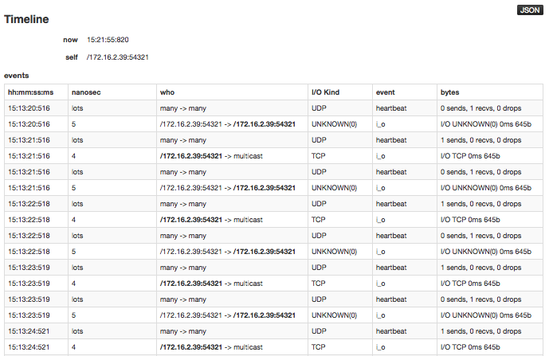

Admin: Timeline
=====================================

To display a chronological list of H\ :sub:`2`\ O status
events (for example, when a cluster was started), click the **Admin** menu and select **Timeline**. 

