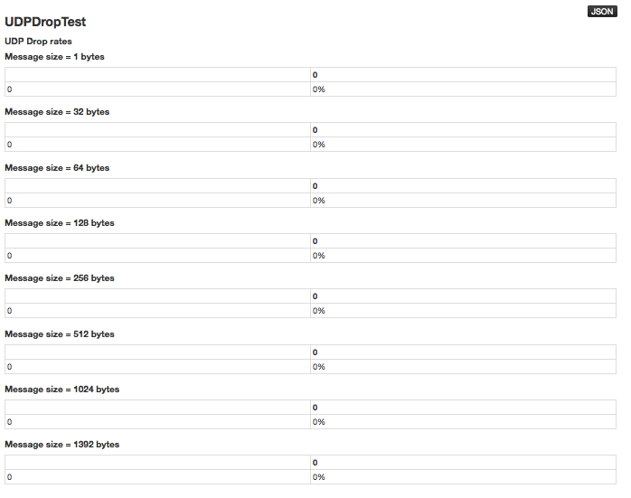

Admin: UDP Drop Test
=====================================

H2O requires UDP on the `INTERNAL_COMMUNICATION` port (54322).

To display the results of a UDP connectivity test, click the **Admin** menu menu and select **UDP Drop Test**.   

