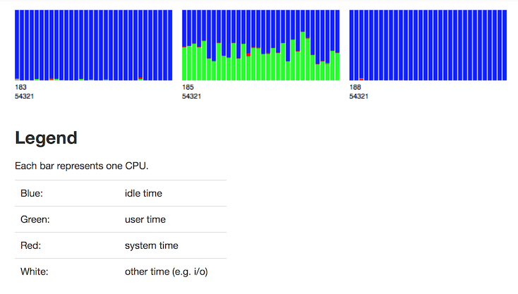

Admin: Water Meter (Perfbar)
=====================================

To view the status of the CPUs in the cluster as a real-time graph, click the **Admin** menu and select **Water Meter (Perfbar)**. 

Each bar in the chart reprints one CPU. 

**Legend**

- Blue: idle time
- Green: user time
- Red: system time
- White: other (e.g., i/o) time

